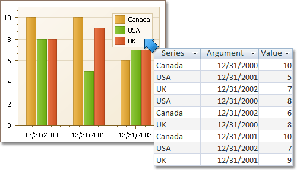

# Data Page
## Tasks
* Provide data for a chart;
* Bind a chart or individual series to a data source;
* Customize an argument and a value scale type;
* Customize the view type of auto-generated series;
* Apply data filtering and sorting;
* Adjust the Pivot Chart settings.

## Page Elements

You can provide data for a chart using the following tabs.
* [Points tab](#pointstab)
* [Series Binding tab](#seriesbindingtab)
* [Auto-created Series tab](#autocreatedseriestab)

## <a name="pointstab"/>Points Tab
Use it to manually enter data points for series.

Note that valid **Argument** and **Value** entries must correspond to the **Argument scale type** and the **Value scale type** selected for the appropriate series on the [Series Page](../../../../interface-elements-for-desktop/articles/charting/chart-wizard/series-page.md). Otherwise, an error message will be invoked.

## <a name="seriesbindingtab"/>Series Binding Tab
Use it to provide specific data binding options for each series.

The following illustration demonstrates how it works.

## <a name="autocreatedseriestab"/>Auto-created Series Tab
Use it to specify data columns used to generate series, as well as the series view type and other options like sorting, filtering and name template.

The following illustration demonstrates how it works.

For familiar data sources (such as Pivot Grid), you can choose to automatically adjust the binding and layout settings of your Chart.

And when you set a Pivot Grid as a Chart's data source, the **Pivot Grid Data Source** tab becomes available.

On this tab you can adjust various Pivot Chart options.

