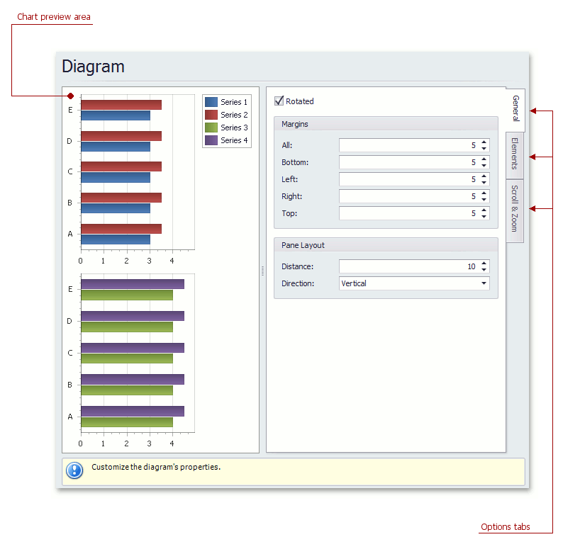

# Diagram Page
## Tasks
* Rotate a diagram;
* Define a diagram's padding;
* Add or remove secondary axes;
* Add or remove panes;
* Define panes' layout direction;
* Enable or disable a diagram's scrolling and zooming.

## Page Elements

**Chart preview area**

Previews a chart's layout.

**Options tabs**

The following  tabs are available on this page.
* **General**
	
	Choose whether a diagram should be rotated, set its padding values, and (if it contains several panes) define the panes' layout direction.
* **Elements**
	
	Add or remove secondary axes and panes.
* **Scroll &amp; Zoom**
	
	Enable or disable a diagram's scrolling and zooming, and specify the scrolling and zooming options.