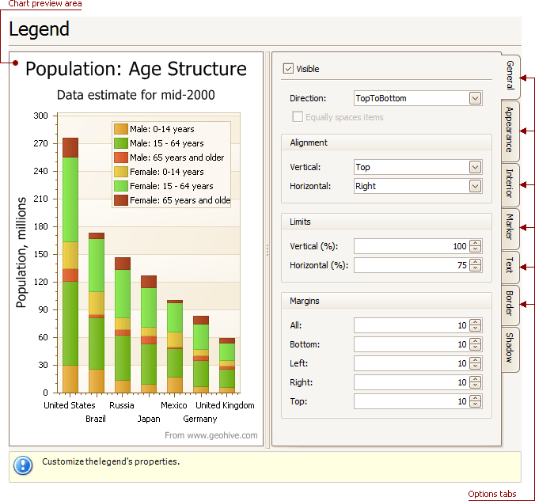
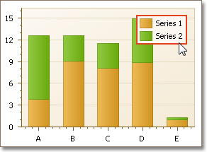

# Legend Page
## Tasks
* Customize chart legend's properties.

## Page Elements

**Chart preview area**

Previews a chart's layout.

Note that you can select the legend directly on the chart preview area.

**Options tabs**

The following tabs are available on this page.
* **General**
	
	Specifies legend visibility, direction, alignment, spacing, limits and margins.
* **Appearance**
	
	Specifies legend background color and background image.
* **Marker**
	
	Specifies visibility and dimensions of legend markers.
* **Text**
	
	Specifies legend text antialiasing, color and font.
* **Border**
	
	Specifies visibility, color and thickness of legend borders.
* **Shadow**
	
	Specifies visibility, color and size of the legend shadow.