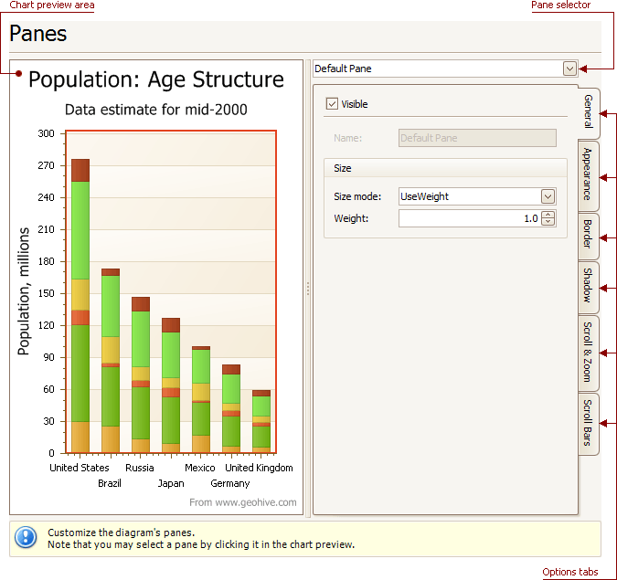

# Panes Page
## Tasks
* Customize panes properties.

## Page Elements

**Chart preview area**

Previews a chart's layout.

**Pane selector**

Specifies a pane to be customized.

**Options tabs**

The following  tabs are available on this page.
* **General**
	
	Determines whether the selected pane should be visible, specifies its name, size mode and size value.
* **Appearance**
	
	Specifies a pane's background color and fill style, and its background image.
* **Border**
	
	Determines whether a pane's border should be visible, and defines its color.
* **Shadow**
	
	Determines whether a pane's shadow should be visible, and defines its color and size.
* **Scroll &amp; Zoom**
	
	Enable or disable a pane's scrolling and zooming for specific axes.
* **Scroll Bars**
	
	If scrolling and/or zooming is enabled for an axis, adjust the scroll bars visibility, position and appearance.