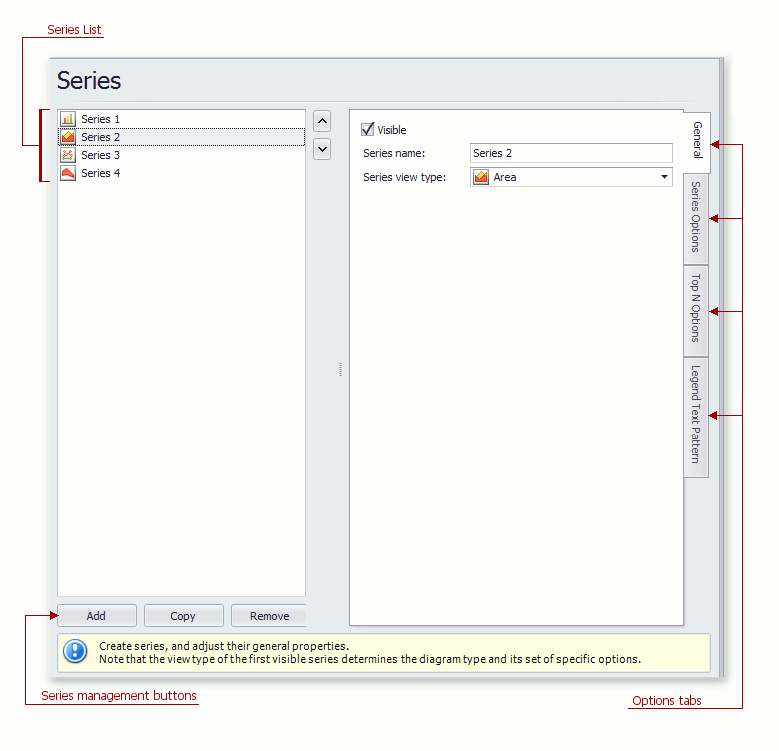

# Series Page
## Tasks
* Create or remove a series of points.
* Define the series name, visibility and view type.
* Customize additional series options and legend point options.
* Enable and customize the Top N Values feature.

## Page Elements

**Series List**

This list displays all available series. You can click list entries to access properties of the corresponding series. To switch between series, use the **&#8743;** and **&#8744;** buttons.

**Series management buttons**

Use the **Add**, **Copy** and **Remove** buttons to manage the series collection.

**Options tabs**

The following tabs are available on this page:
* **General**
	
	Choose whether the selected series should be visible, define its name, and select a view type.
* **Series Options**
	
	Specifies argument and value scale types, the point sort order, visibility in the legend, whether the legend is checked,  and legend text.
* **Top N Options**
	
	Specifies whether the Top N Values feature is enabled, and allows you to control this feature's options.
* **Legend Text Pattern**
	
	Specifies the format of values displayed in the chart legend.