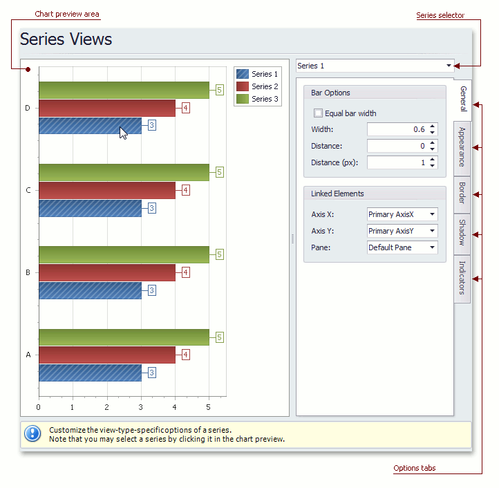

# Series Views Page
## Tasks
* Customize the view-type-specific properties of series;
* Customize the appearance and border settings of series;
* Add or remove financial indicators (Fibonacci indicators, trendlines and regression lines).

## Page Elements

**Chart preview area**

Previews a chart's layout.

Note that you can select a series to be modified directly in the chart preview area.

**Series selector**

Specifies a series to be customized.

**Options tabs**

The following tabs are available on this page.
* **General**
	
	Specifies a series bar's width, distance, color, transparency, etc.
* **Appearance**
	
	Specifies a series color, transparency and fill style. Additionally, determines whether series points should be painted individually.
* **Border**
	
	Determines whether a series border should be visible, and defines its color and thickness.
* **Shadow**
	
	Specifies whether a series' shadow should be visible, determines its color and size.
* **Indicators**
	
	Allows you to add or remove indicators of a required kind (Regression Line, Trend Line, Fibonacci Arcs, Fibonacci Fans, Fibonacci Retracement and many others).