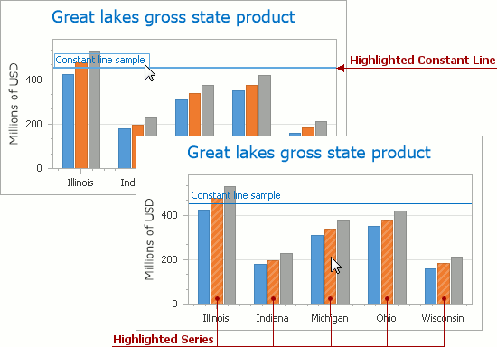
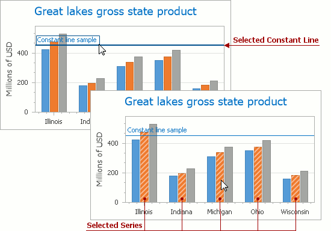
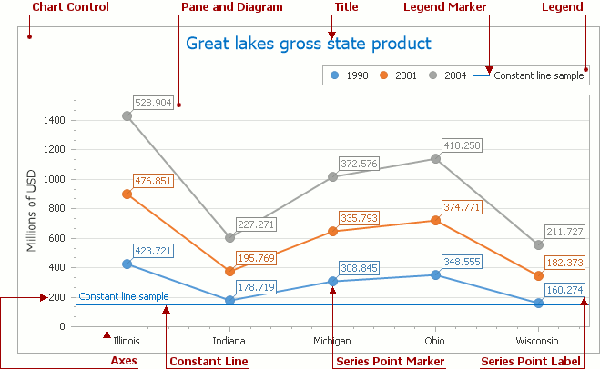

# Highlighting and Selection Chart Elements
If you are working with 2D charts, you can highlight and select different chart elements via the mouse or using different gestures on your touchscreen device.

## Highlighting
Any chart element that can be selected supports highlighting.

An end user can highlight a chart's area using either the drag gesture on your touchscreen device or via the mouse pointer by hovering over a particular chart element, as shown in the image below.

> [!NOTE]
> Chart element highlighting and selection is available only for **2D Chart Types**.

## Selection
To select a particular chart element, an end user should tap it on a device supporting touchscreen or click this element using the left mouse button. The following image demonstrates how a constant line and a single series are painted if selected by an end user with the mouse pointer.

## Selectable Elements
Chart elements which can be highlighted or selected are shown in the following illustration.

