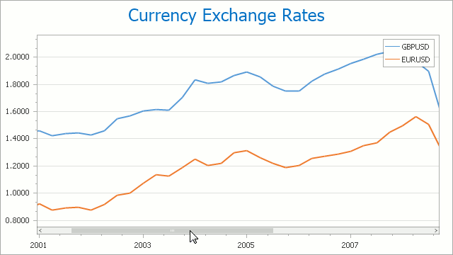

# Scroll a Chart
You can scroll a chart if either the axis visible range is reduced or a chart is already zoomed in (its zoom factor is more than 100%). Since the entire chart is not visible at one time, it's possible to scroll a chart.

## Scroll a 2D Chart
To scroll a 2D chart, do one of the following:
* **Hold down the left mouse button, and drag it**.
	
	After you hold down the left mouse button, the mouse pointer is changed from  to . Then drag the mouse pointer to scroll the diagram.
* **Use scrollbars**.
	
	An end-user is able to click a scrollbar arrow, click the scrollbar near the thumb, or drag the thumb and move it.
	
	
	
	In this instance, a chart's diagram is scrolled in the same way as controls in used Windows applications.
* **Use flick gestures on a touchscreen device**.
	
	An end-user can scroll a diagram using flick gestures on a  touchscreen device.
	
	
* **Use CTRL+ARROW combinations**.
	
	When an end-user presses CTRL + LEFT, a chart's diagram is moved to the left.
	
	When an end-user presses CTRL + UP, a chart's diagram is moved to the top.
	
	When an end-user presses CTRL + RIGHT, a chart's diagram is moved to the right.
	
	When an end-user presses CTRL + DOWN, a chart's diagram is moved to the bottom.

## Scroll a 3D Chart
An end-user can perform chart scrolling doing one of the following:
* **Hold down the mouse wheel button on a chart and drag it**.
	
	After you hold down the mouse wheel, the mouse pointer is changed from  to . Then drag the mouse pointer to scroll a chart's diagram.
* **Use CTRL+ARROW combinations**.
* **Use flick gestures on a touchscreen device.**
	
	An end-user  can scroll a diagram using flick gestures.