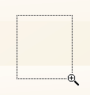

# Zoom a Chart
If you are working with 2D XY-charts (Bar, Line, Point, etc.) or 3D charts, you can zoom in or out of a chart. This allows you to see some of the chart's data in greater detail, or get a more general picture of your data.

Note that zooming is unavailable for 2D Pie, 2D Doughnut, Radar, and Polar charts.

## Zoom In a Chart
To zoom in a chart, do one of the following.
* **Hold down SHIFT and click.**
	
	After you press SHIFT, the mouse pointer is changed to . Then, move the mouse pointer to the chart region to be zoomed into, and click (while holding SHIFT). The magnification factor is 300%.
* **Press SHIFT and select a region on a diagram.**
	
	After you press SHIFT, the mouse pointer is changed to . Then, select a zoomed region by dragging the mouse pointer.
	
	
	
	After releasing the left mouse button, a chart is zoomed into the bounds of the selected region on a diagram.
	
	> [!NOTE]
	> This feature is available for 2D charts only.
	> 
	> if you press SHIFT and can't zoom in anymore (the mouse pointer is changed to ), then a chart is already zoomed in by **100** times (10000%). This is the maximum possible zoom factor allowed.
* **Use CTRL+PLUS SIGN.**
	
	In this case, the magnification factor is 120%.
* **Use the spread gestures on a touchscreen device**.
	
	An end-user can zoom in a chart's diagram performing spread gestures on any device supporting touchscreen.
	
	
* **Use the mouse wheel.**
	
	In this case, the magnification factor is 120%.

## Zoom Out of a Chart
To zoom out of a chart, do one of the following.
* **Hold down ALT and click.**
	
	After you press ALT, the mouse pointer is changed to . Then, move the mouse pointer to the region to be zoomed out, and click (while holding ALT). The magnification factor is 300%.
* **Use CTRL+MINUS SIGN.**
	
	In this case, the magnification factor is 120%.
* **Use the pinch gestures on a touchscreen device**.
	
	A chart's diagram can be zoomed out by performing pinch gestures on any device supporting touchscreen.
	
	
* **Use the mouse wheel.**
	
	In this case, the magnification factor is 120%.

## Undo Zooming
Press CTRL+Z to return to the state before the first zoom operation in a series.