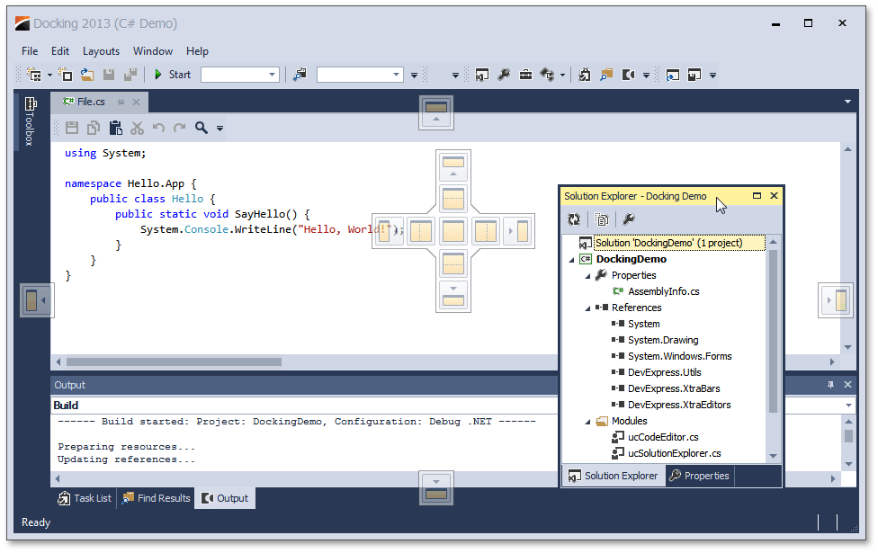
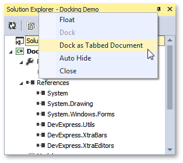
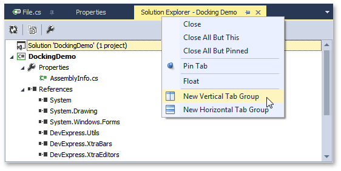
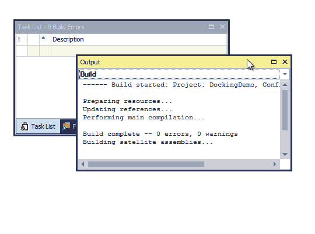

# Dock Panels
This topic describes the most common runtime operations for dock panels.

## Docking Hints
Dock panels can be docked, floating or auto-hidden. To dock or undock a panel, simply click its header and drag the panel. As you drag the panel over an application form, docking hints appear (see the figure below). Use these hints to dock the panel to the desired position.

Docking hints are semi-transparent square elements that allow you to dock a panel to a form's edges, or to an existing container as a tab, or between other docking elements. These hints are displayed separately or grouped in a docking guide (e.g., in the form's central area). Finally, a docking zone is a semi-transparent preview of exactly where your panel will be docked. This zone is displayed when you drag a panel into a docking hint, but before you drop it.

## Buttons
Dock panels have multiple state change buttons in their top right corner.
* **Close** - closes the current panel.
* **Maximize**/**Restore** - maximizes the panel to full-screen size, or restores it back to its original size. Available only for floating panels.
* **Auto-hide**/**Dock** - hides the panel, leaving only its header visible, or restores an auto-hidden panel back to the docked state. Depending on the application settings, hidden panels are displayed either on mouse hover or on click only. Available only for docked panels.
* **Pin** - places the panel in the first tab position. Available only for panels docked as tabbed documents.

## Context Menu
Most docking operations are available from the panel's context menu, displayed on right-click. The figure below illustrates the context menu for a docked panel.

For dock panels docked as tabbed documents, the context menu displays multiple additional items, which allow you to pin the panel or start a new horizontal or vertical group within the docked area (see the image below).

## Interoperability with Documents and Other Dock Panels
When dragging a dock panel, you can dock it to other dock panels. This will create a dock panel container that presents both panels as tabs. Note that in addition to docking panels via docking hints, you can also drag them to the tab header area. This allows you to instantly rearrange panels within the container (see the animation below).

Dock panels can be docked to both the dock panel docking areas (the form's edges) as well as to the tabbed View. Documents, however, can only be docked within the tabbed View, and not to the docking areas.

## Mouse Operations and Hotkeys
* **Double-click** a docked panel's caption - undocks the panel and makes it floating. This does not work with auto-hide panels.
* **Ctrl**+**Double-click** a floating panel's caption - docks the floating panel to its previous docking position.
* **Esc** while dragging a panel - cancels the dock operation and drops the panel at the current position.
* **Ctrl**+**Tab** or **Crtl**+**Shift**+**Tab** - shows the Document Selector. See the [Dock Panels](dock-panels.md) topic to learn more about the Document Selector.