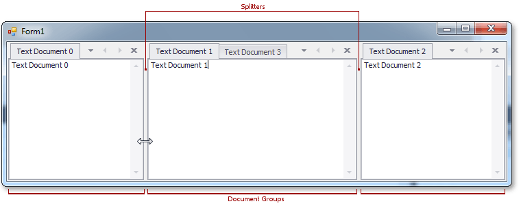
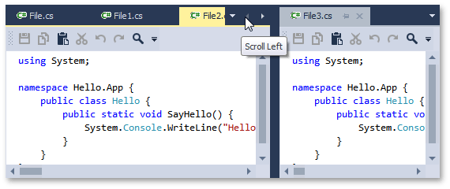
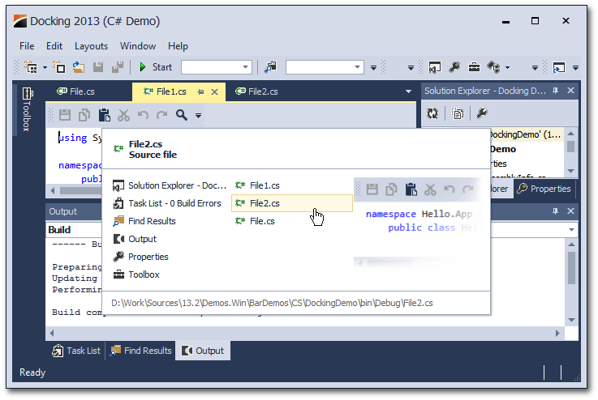
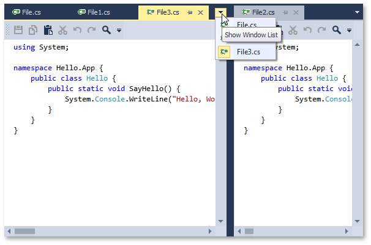
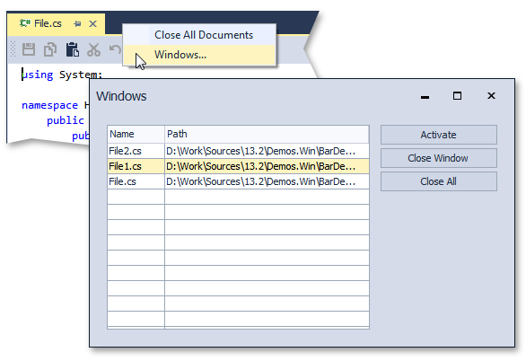

# Documents
Document objects resemble dock panels and serve the very same goal - to host content within floating or tabbed MDI windows. You can click a document’s caption, and drag this document to dock or undock it in the same manner as dock panels. However, there are certain differences between documents and dock panels.

## View
While dock panels can be docked to any form’s edge, documents can only be docked in a special area called a tabbed View. When you drag a document, docking hints will tell you where this area is. The image below illustrates a tabbed View within a tabbed MDI application.

Dock panels can also be docked into this area, but documents cannot be docked to auto-hide containers and form edges.

## Floating Document Container
As you can see from the image above, documents can be nested into a floating document container. If this feature is enabled, it allows you to organize all of your floating documents in a single floating container (and avoid a cluttered UI with multiple floating windows). If you want to dock your floating documents once again, simply drag this container in the same manner in which you drag documents. Docking a floating container into a tabbed View will dock all of the container's documents into this View. You can also rearrange within or drag individual documents out of this container.

## Tabbed Groups
Documents within a tabbed View can be docked to vertical or horizontal document groups. To do so, use the side docking hint when dragging a document, or right-click the document header and select the **New Tab Group** item in the invoked context menu (see the figure below).

Document groups are divided by splitters. You can drag the splitter to resize the groups, as shown in the figure below.

Document groups can display **Next** and **Previous** buttons, which allow you to scroll through tab headers when there is not enough free space within the group to display all of the headers.

Document groups within a View can either be arranged horizontally (side-by-side), or vertically (one above another), but not in both directions simultaneously. If only one tabbed group exists, the View does not yet have an orientation setting. After you start a new horizontal tab group, for example, the View becomes vertically oriented, which means that all subsequent tab groups can only be arranged vertically. You can reverse the current View orientation by right-clicking any tab group header and selecting the **Arrange Tab Groups Vertically (Horizontally)** context menu item.

## Navigation
To navigate through documents (and dock panels, if any exist), you can use the Document Selector, invoked via the **CTRL**+**Tab** keyboard hotkey. This tool displays a small preview of each focused document (dock panel) and its short description. You can see the Document Selector in the next image.

To quickly navigate through documents, you can also use the button in the group's top right corner. 

Finally, you can right-click a document group's header and select the **Windows...** item to display the Windows dialog, which lists all currently opened documents and their paths (see the image below).

## Mouse Operations and Keyboard Shortcuts
* **Double-click** a docked document's caption - undock the document and make it floating.
* **Ctrl**+**Double-click** a floating document's caption - docks the floating document to its previous docking position.
* **Ctrl**+**Tab** or **Ctrl**+**Shift**+**Tab** - shows the Document Selector.