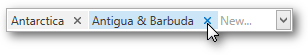

# Manipulating Tokens
## Add a Token

To add a new token, do any of the following.
* Click an item from the dropdown.
* Type the item name in the text field and press ENTER.

Rotate the wheel button to scroll through items. Press the UP ARROW or DOWN ARROW to navigate the items one by one.

## Remove a Token

To remove a token, click the **Remove Token** button.

## Clipboard Operations

To select multiple tokens, click each token you want to select while holding down the CTRL button.

To copy selected tokens to the clipboard, press CTRL+C.

To paste the tokens from the clipboard, click within a token editor and press CTRL+V.