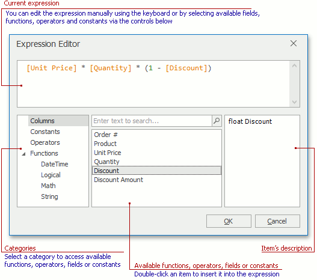

# Expression Editor
The Expression Editor allows you to edit various Boolean or regular expressions in controls:

In this editor, you can type an expression manually, or select functions, operators and operands using the editor's controls.

An expression is a string that, when parsed and processed, evaluates some value. Expressions consist of column/field names, constants, operators and functions. Column/field names must be wrapped with brackets. The following are examples of regular expressions:

_"[Quantity] * [UnitPrice] * (1 - [BonusAmount])"_

Boolean expressions:

_"[Country] == 'USA'"_

The Expression Editor supports numerous standard functions, allowing you to easily perform different string, date-time, logical and math operations over data. You can access the available functions by selecting the **Functions** category.