# Examples of Using the Filter Editor
The [Filter Editor](filter-data-via-the-filter-editor.md) allows you to filter data (display those records that meet specific requirements), by visually constructing filter criteria in a straightforward graphical form.

The following sections demonstrate how to construct filter criteria using the Filter Editor.

## How to Construct a Simple Filter Condition
Basically, filter conditions specify what data to select from a data source and display in a data-bound control. A typical simple filter condition consists of three parts: the column/field name, operator and a value(s). For instance, '[Discount] &gt;= 0.05' is a simple filter condition, where '[Discount]' is a field name, '&gt;=' is an operator and '0.05' is a value. This condition when applied to a data-aware control will display records that have values in the Discount column greater than or equal to 0.05. Here is how to create this condition via the Filter Editor (it's assumed that the underlying data source contains the Discount column, otherwise, this column will not be accessible in the Filter Editor's column list):
1. **Invoke the Filter Editor.**
	
	To invoke the Filter Editor in a grid control, right-click any grid column's header and select the Filter Editor option.
	
	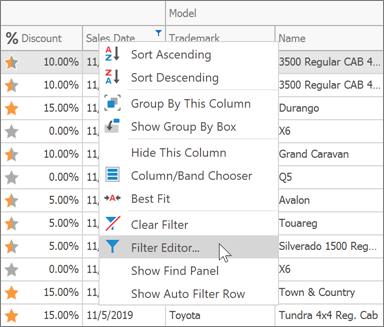
	
	To learn how to invoke the Filter Editor for other controls, see corresponding sections in this documentation.
2. **The Filter Editor will pop up.**
	
	When invoking the Filter Editor for a grid control, if no filtering has yet been applied, the Filter Editor will contain a new filter condition referring to the clicked column. If, for example, the Filter Editor has been opened by right-clicking a Product Name column, it will look like the image below:
	
	
3. **Select a column**.
	
	Now, to filter against the Discount column, click the condition's link displaying a column name ('Product Name'). This will display the list of available columns. Select the Discount column in this list:
	
	
4. **Select a comparison operator**.
	
	To select the '&gt;=' comparison operator, click the condition's operator link ('Equals') to display the list of supported comparison operators and select the required operator:
	
	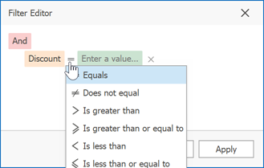
	
	The comparison operator list displays only those operators that are supported by the current column's data type. For instance, the Discount column is of the numeric type, and the operator list doesn't display the 'Begins with' operator and other operators that are related to strings.
5. **Enter a value**.
	
	Now, click the value box and enter a comparison value ('0.05'):
	
	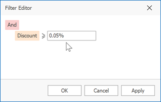
6. **Save changes**.
	
	Click OK or Apply, to filter data using the created filter condition. The grid will show the filter panel displaying the current filter criteria:
	
	
	
	The filter panel will contain the 'Edit Filter' button, which also allows you to invoke the Filter Editor.

## How to Construct Filter Criteria with Multiple Conditions Joined by One Logical Operator
Filter criteria typically consist of two or more simple filter conditions combined by logical operators (AND, OR, NOT AND, NOT OR). The following example shows how to construct filter criteria in the Filter Editor that consist of multiple conditions combined by one logical operator. The "[ProductName] = 'Tofu' AND [Discount] &gt;= 0.1 AND [Quantity] > 99" filter expression contains three simple filter conditions combined by the AND operator. To construct it, do the following:
1. Invoke the Filter Editor. When the Filter Editor is invoked for a grid control, the Filter Editor may display an unfinished new filter condition:
	
	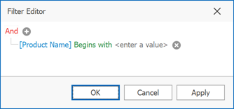
2. Set the condition's operator to Equals and operand value to 'Tofu' (as described in the previous section):
	
	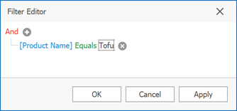
3. To add one more condition, press the  button next to the group's AND operator:
	
	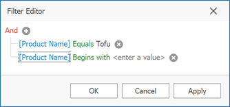
	
	This will create a new condition under the current one:
	
	
4. For the second condition, set the column to 'Discount', operator to '>=' and operand value to '0.1':
	
	
5. To add a third condition to the same group, click the  button again. Set the condition's column to 'Quantity', operator to '>' and operand value to '99'. Below is the result:
	
	
6. Click OK or Apply, to apply the created filter criteria.

## How to Construct Filter Criteria Involving Different Logical Operators
Some filter criteria contain multiple logical (Boolean) operators combining simple filter conditions. For instance, you want to see items whose price is under 10, and at the same time, the available quantity is also less than 10. At the same time, you may also want to see those items whose price is over 10, while the available quantity is also greater than 10.

The resulting condition will look like this:

``(Price is less than 10 AND Quantity is less than 10) OR (Price is greater than 10 AND Quantity is greater than 10)``

This is how you can do this:
1. Invoke the Filter Editor.
2. Clear existing filter conditions (if any) by clicking the   button:
	
	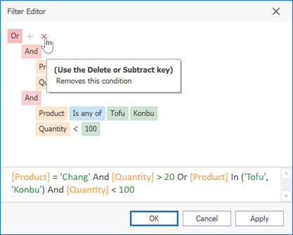
3. Change the root logical operator to OR. To do this, click the current AND operator and select OR:
	
	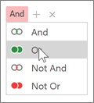
4. Add a new filter condition group by clicking the OR operator and selecting Add Group.
	
	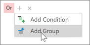
5. For the created condition, set the column to 'UnitPrice', operator to '&lt;' and operand value to '10':
	
	
6. Click the  button to add a new condition to the current group:
	
	
7. For the new condition, set the column to 'Quantity', operator to '&lt;' and operand value to '10':
	
	
8. Add a new filter condition group. To do this, click the root OR operator and select Add Group.
	
	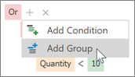
9. For the condition within the created group, set the column to 'UnitPrice', operator to '&gt;' and operand value to '10':
	
	
10. Click the  button to add a new condition to the new group:
	
	
11. For the new condition, set the column to 'Quantity', operator to '&gt;' and operand value to '10':
	
	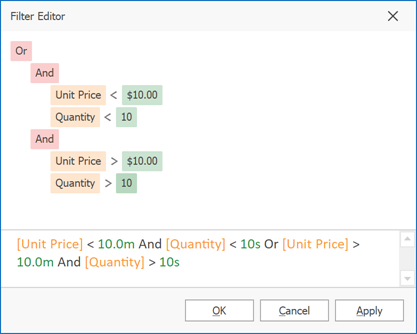
12. Click OK or Apply, to apply the created filter criteria.