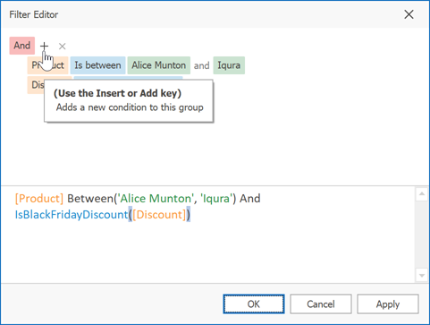
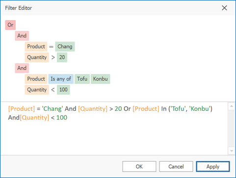

# Filter Data via the Filter Editor
## Filter Editor
The **Filter Editor** is used to edit filter criteria. To create and customize filter criteria, use the  and  buttons embedded into the control and context menus supported by the editor's elements:

**Remarks**

A filter condition **group** is a set of conditions combined by the same logical operator. The following filter expression contains two groups combined by the logical OR operator: "([Product] = 'Chang' And [Quantity] &gt; 20) Or ([Product] In ('Tofu', 'Konbu') And [Quantity] &lt; 100)". In the Filter Editor it's represented as follows:

For step-by-step examples of creating filter criteria, see [Examples of Using the Filter Editor](examples-of-using-the-filter-editor.md).

## Add Conditions
To add a condition to a logical group, do one of the following:
* Focus any condition within the group or the group's logical operator and then press INSERT or ADD on the keyboard.
* Click the  button for the group.
* Click the group's logical operator and select **Add Condition**.

To add a condition or a group of conditions that have been copied to the clipboard, press CTRL+V or SHIFT+INSERT. The new condition will be added to the focused group.

## Delete Conditions
To delete a condition, do one of the following:
* Focus the condition and press DELETE or SUBTRACT.
* Click the  button.

To delete a group of conditions, do one of the following:
* Focus the group's logical operator and press DELETE or SUBTRACT
* Click the group's logical operator and select **Remove Group**.

To delete all conditions, do one of the following:
* Focus the topmost logical operator and press DELETE or SUBTRACT.
* Click the topmost logical operator and select **Clear All**.

To cut a condition/group of conditions to the clipboard, focus this condition or the group's logical operator and press CTRL+X or SHIFT+DELETE.

## Clipboard Operations
To copy a condition or a group of conditions to the clipboard, focus this condition or the group's logical operator and press CTRL+C or CTRL+INSERT.

To cut a condition or a group of conditions to the clipboard, focus this condition or the group's logical operator and press CTRL+X or SHIFT+DELETE.

To paste a condition or a group of conditions from the clipboard to the focused group, press CTRL+V or SHIFT+INSERT.

## Change a Column in a Filter Condition
To change a condition's column, invoke the column list by doing one of the following:
* Click the current column.
* Focus the current column via the keyboard and press SPACE or ALT+DOWN ARROW.

Then, choose the required column from the list that will be invoked

## Change an Operator in a Filter Condition
To change a condition's operator, invoke the operator list by doing one of the following:
* Click the condition's current operator.
* Focus the current operator via the keyboard and press SPACE or ALT+DOWN ARROW

Then, choose the required operator from the list that will be invoked

## Edit a Condition's Value
To edit a condition's value, click the operand value and type text.

To activate the operand value's edit box without changing the value, click the value or focus the operand value via the keyboard and press F2, SPACE, ENTER or ALT+DOWN

To close the active edit box, press ENTER.

To discard changes to the value and close the active edit box, press ESC.

## Navigation
To focus a specific filter condition or a group's operator within the Filter Editor, do one of the following:
* Click the target element.
* Use arrow keys to move focus via the keyboard.