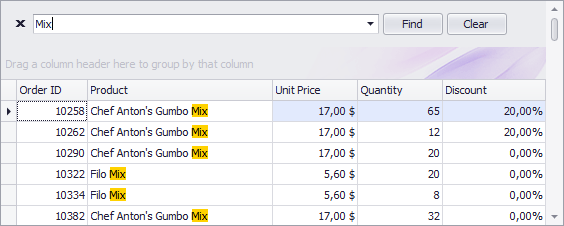
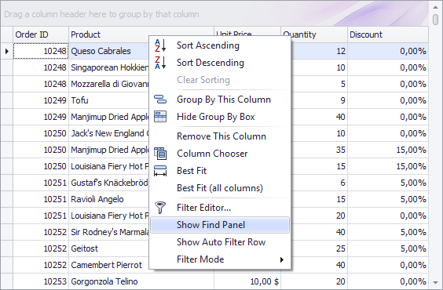

# Filter Grid Data via Find Panel
The Find Panel provides an easy way of searching against visible columns/card fields. Displayed above the grid, the panel contains a search box where you can type a search string.

## Invoke the Find Panel
* Ensure that no cell editor is active and press Ctrl+F.

or
* In Grid Views, choose the Show Find Panel command from a column menu.
	
	

## Search
* Enter a search string in the search box. In most cases, rows are filtered automatically after a short while.
* In some cases (mostly when the grid is bound to a large amount of data), you need to press the Find button to manually start the search.

The search syntax is described below.

## Clear the Search Box
Press ESC or click the Clear button.

## Close the Find Panel
Click the 'x' button to the left of the search box or:
* If the search box is empty, press ESC (the shortcut is in effect if the search box has focus);
* If the search box is not empty, press ESC twice (the shortcut is in effect if the search box has focus).

## Search Syntax
In its simplest form, a search criterion consists of a single word. If you want to search for a string containing a space character, specify this string in quotation marks. Without quotation marks, words separated by the space character are treated as individual conditions.

You can search against a specific column by preceding a search string with the column's display name plus a colon character.

``ColumnDisplayName:SearchString``

Instead of the complete name, it is possible to partially specify the display name, using the initial characters of a column's display name. A search will be performed against the first column whose display name starts with the specified substring.
If you want to search against a column whose display caption contains space characters, specify the column's display caption in quotation marks.

If the search string contains multiple conditions separated by space characters, and at least one condition defines a search against a specific column, only records that match all of these conditions are shown (i.e., the conditions are combined by the **AND** logical operator). 
If there is no column specification, records that match at least one of these conditions are shown (i.e., the conditions are combined by the **OR** logical operator).

Precede a condition with "+" to display only records that match this condition. The "+" specifier allows you to implement the logical **AND** operator. There should be no space character between the "+" sign and the condition.

Precede a condition with "-" to exclude records that match this condition from the result set. There should be no space between the "-" sign and the condition.

**Examples**

| Search Criteria | Description |
|---|---|
| ``register`` | Selects records that contain the "register" string in any search column. |
| ``check register Dave`` | Selects records that contain either "check" OR "register" OR "Dave" strings in any search column. |
| ``"check register"`` | Selects records that contain "check register" in any search column. |
| ``screen +"Richard Fisher"`` | Selects records that contain both "screen" AND "Richard Fisher" in search columns. |
| ``Product:Tofu Seattle`` | Selects records that contain "Tofu" in the column that starts with "Product", AND also contain "Seattle" in any search column. |
| ``data +entry -mark`` | Selects records that contain both "data" AND "entry" in search columns, excluding records that contain "mark". |
| ``menu mask -file`` | Selects records that contain "menu" OR "mask", excluding records that contain "file". |
| ``From:Roller Subj:"currency mask"`` | Selects records that contain "Roller" in the column that starts with "From", AND also contain "currency mask" in the column that starts with "Subj". |
| ``import -From:Steve`` | Selects records that contain "import" in any search column, excluding records that contain "Steve" in the column that starts with "From". |

> [!NOTE]
> Searches performed using a Find Panel are case insensitive.