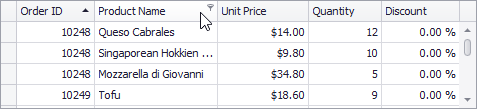
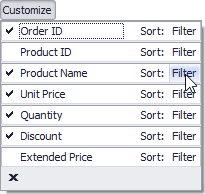
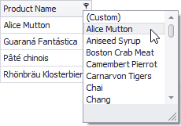
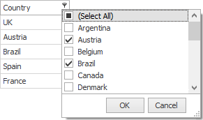
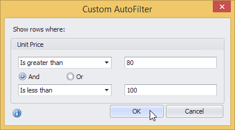
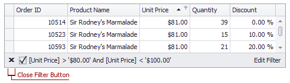
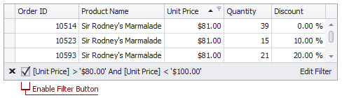

# Filter Grid Data
## Invoke the Filter Dropdown List
* In Grid Views, hover over the column header. Click the filter button () within the column header that appears.
	
	
* In Card Views, click the Customize button and then click the Filter button corresponding to the target column.
	
	
* In Layout Views, hover over the target card field within any card. Click the filter button () that appears.
	
	

## Create a Simple Filter Condition
To select records that contain a specific value in a specific column/card field, do the following:
1. Invoke the filter dropdown list containing available filter values.
	
	By default, if filtering is applied, the filter dropdown will only display the values which match the current filter criteria. If the SHIFT key is pressed while opening the filter dropdown, all values will be listed (not only those that match the current filter criteria).
2. Select the required filter value in the filter dropdown list:
	
	
	
	The filter dropdown list will be immediately closed, and the control will display the records which contain the specified value in the specified column/card field.
	
	If the filter dropdown list provides check boxes to the left of filter values, multiple values can be selected (checked) simultaneously:
	
	
	
	In this mode, click OK to close the filter dropdown list and apply the filter.

You can sequentially filter data against multiple columns using the method described above.

## Use Microsoft Excel Style Custom Filter Dialog
To construct filter criteria involving up to two conditions, do the following:
* Invoke the filter dropdown list (see above) and click **Custom**. This will invoke the Custom Filter Dialog, allowing you to compare a column with one or two values:
	
	

## Use Advanced Filter Editor Dialog
To invoke an advanced Filter Editor dialog, do one of the following:
* Right-click any column's header and select **Filter Editor**:
	
	
* If the filter panel at the bottom of the grid control is visible, click the **Edit Filter** button:
	
	

To learn how to work with the Filter Editor, refer to [Filter Data via the Filter Editor](../../filter-editor/filter-data-via-the-filter-editor.md).

## Clear the Filter
To clear the filter applied to a specific column, do one of the following:
* Invoke the filter dropdown list (see below) and click (All).
* In Grid Views, right-click the column header and select Clear Filter:

To clear all filter criteria, click the Close Filter button within the Filter Panel:

## Disable/Enable the Filter
Click the Enable Filter button within the Filter Panel:

