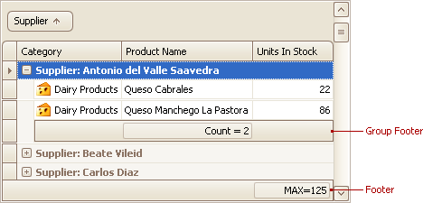

To change the type of summary for a specific column or apply a summary, do the following:
1. Right-click a region within a group footer or grid footer under a specific column:
	
	
	
	A context menu displaying a list of supported summary types will be displayed:
	
	
2. Select the required option from the context menu.