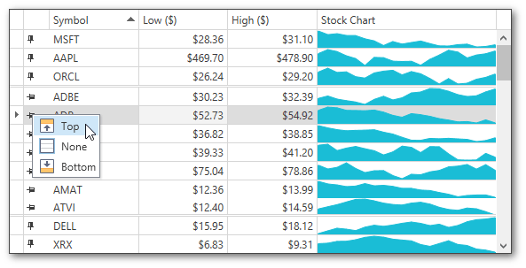
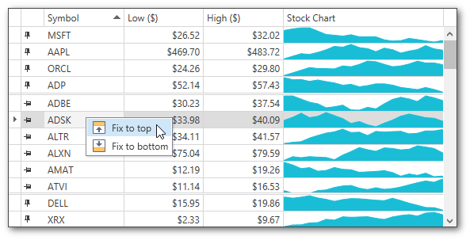

# Fix Grid Rows
Some applications allow you to fix grid rows at the top or at the bottom of the grid. Fixed rows remain visible while the grid content is scrolled vertically.

> [!NOTE]
> The following steps may vary depending on an application vendor.

## Fix a Row
To fix a grid row, do one of the following.
* Click the **Fix Row**  button located at the left side of a grid row.
	
	Choose the required fixed row position from the popup menu.
	
	
* Right-click a grid row.
	
	Choose the required fixed row position from the context menu.
	
	

## Change a Fixed Row's Position
To unfix a row or change a fixed row's position, do one of the following.
* Click the **Unfix Row**  button located at the left side of a fixed grid row.
	
	From the popup menu, choose the required fixed row position. Select **None** to unfix a grid row.
	
	
* Right-click a fixed grid row.
	
	Choose the required fixed row position from the context menu. Select **Unfix** to unfix a row.
	
	