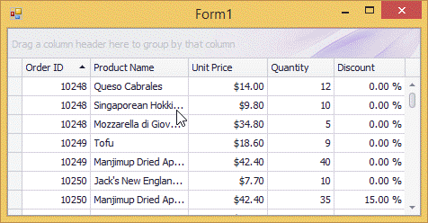
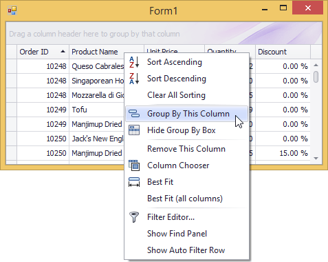
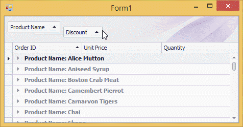
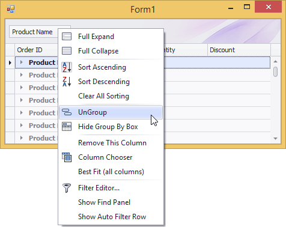
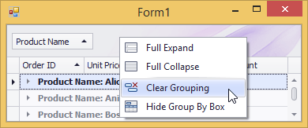
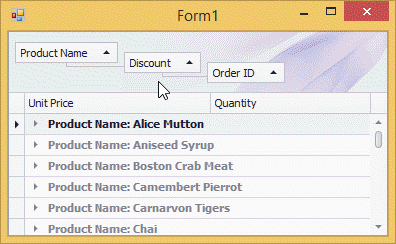

# Group Grid Rows
## Group Data
To group by a specific column, do one of the following:
* Drag a column header from the column header panel to the group panel:
	
	
* Right-click a column header and select **Group By This Column** from the context menu:
	
	

## Ungroup Data
To ungroup data by a grouping column, do one of the following:
* Drag a column header from the group panel to the column header panel:
	
	
* Right-click a grouping column's header and select **UnGroup** from the context menu:
	
	

To remove grouping by all columns, right click the group panel and select **Clear Grouping** from the context menu:

## Change Group Order
To change group order, move a grouping column header to another position within the group panel:

