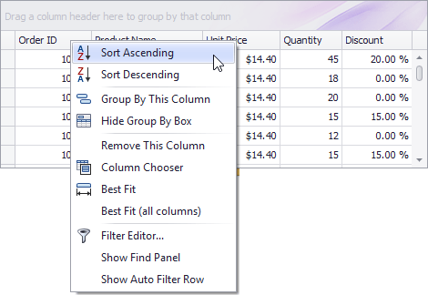
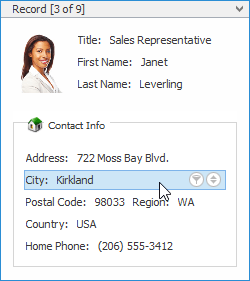

# Sort Grid Rows
## Sort Data in Grid Views
To sort records by a column's values and replace existing sort conditions that are applied to the current or other columns, click the target column's header, until an Up or Down Arrow icon is displayed within the header. The Up and Down Arrows indicate ascending and descending sort orders respectively. 

To sort records by a column's values while preserving existing sort conditions, do one of the following:
* Click a column header while holding the SHIFT key down, until an Up or Down Arrow icon is displayed within the header.
* Right-click a column header and select **Sort Ascending** or **Sort Descending** from the context menu that appears:
	
	

To remove sorting by a column, click a column header while holding the CTRL key down. You can also select Clear Sorting from the column header context menu.

## Sort Data in Card Views
To sort records by a card field's values and replace existing sort conditions that are applied to the current or other fields:
1. Click the Customize button:
	
	
2. In the Customization window that opens, click the Sort button that corresponds to the target card field:
	
	

To sort records by a card field's values while preserving existing sort conditions:
1. Click the Customize button.
2. In the Customization window that opens, click the Sort button that corresponds to the target card field, while holding the SHIFT key down.

To remove sorting by a card field:
1. Click the Customize button.
2. In the Customization window that opens, click the Sort button that corresponds to the target card field, while holding the CTRL key down.

## Sort Data in Layout Views
To sort records by a card field's values and replace existing sort conditions that are applied to the current or other fields, do the following:
1. Hover over the target card field within any card. The sort () and filter buttons will appear.
	
	
2. Click the sort button until its image changes to a black arrow ( or ). These images indicate ascending and descending sort orders respectively.

To sort records by a card field's values while preserving existing sort conditions:
1. Hover over the target card field within any card. The sort and filter buttons will appear.
2. Hold the SHIFT key down and click the sort button until its image changes to a black arrow ( or ).

To remove sorting by a card field:
1. Hover over the target card field within any card. The sort and filter buttons will appear.
2. Hold the CTRL key down and click the sort button until its image changes to two arrows ().