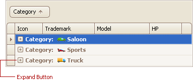
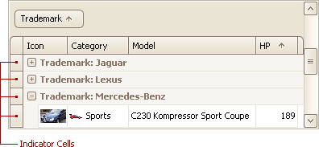
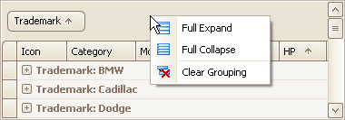
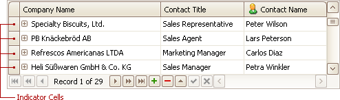
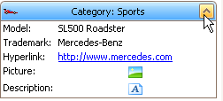

# Expand and Collapse Rows and Cards in Grids
## Expand/Collapse Group Rows in Grid Views
To expand/collapse a group row, do one of the following:
* Click the row's expand button:
	
	
* Double-click the group row.
* Double-click the indicator cell corresponding to the group row:
	
	
* Focus the group row and press PLUS (to expand the row) or MINUS (to collapse the row).
* Focus the group row and press RIGHT ARROW (to expand the row) or LEFT ARROW (to collapse the row).

To expand or collapse all group rows, right-click the group panel at the top of the control. This opens the group panel context menu. Then select Full Expand or Full Collapse respectively:

## Expand/Collapse Master Rows in Grid Views
To expand/collapse a master row, do one of the following:
* Click the master row's expand button:
	
	
* Double-click the indicator cell corresponding to the master row:
	
	
* Focus the master row and press CTRL+PLUS (to expand the row) or CTRL+MINUS (to collapse the row).

## Expand/Collapse Cards in Card and Layout Views
Do one of the following:
* Click a card's Expand button:
	
	
* Click a card's caption and press PLUS (to expand the card) or MINUS (to collapse the card).