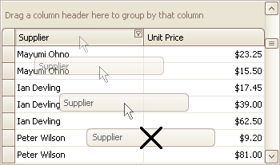
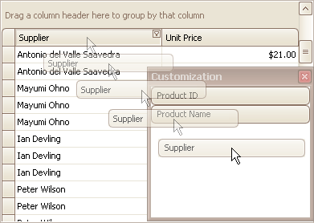
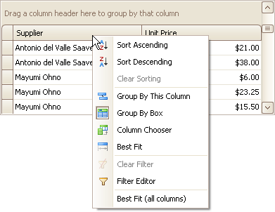
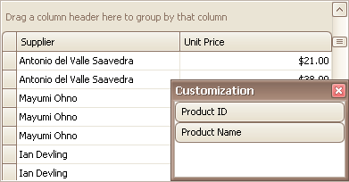
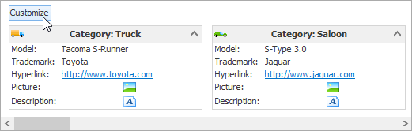
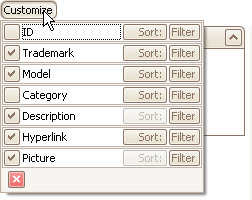
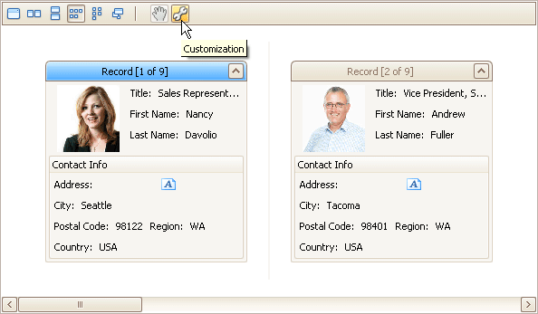
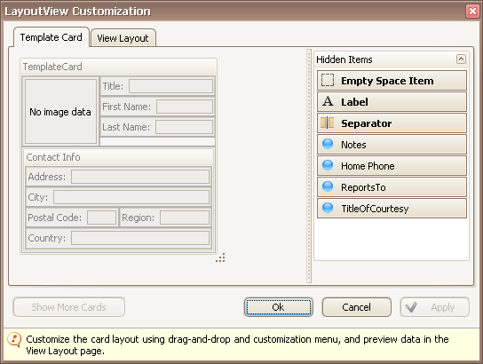

# Hide and Display Grid Columns, Bands and Card Fields
## Hide Columns/Bands in Grid Views
Do one of the following:
* Click a column header/band header and drag it onto the grid control's cell area, until the cursor changes its image to a big 'X'. Then drop the header.
	
	
* Drag and drop a column/band header onto the Customization Form if it's open:
	
	

## Display Hidden Columns/Bands in Grid Views
1. Open the Customization Form by right-clicking a column header and selecting Column Chooser:
	
	
	
	The Customization Form will be displayed listing hidden columns and bands (if any):
	
	
2. Drag the required column/band from the Customization Form onto the column/band header panel and drop it at a specific position.
	
	

> [!NOTE]
> When a band is hidden together with its child bands and columns, headers of hidden children are not displayed within the Customization Form.

## Change the Visibility of Fields in Card Views
1. Click the Customize button:
	
	
2. To hide specific fields, clear corresponding check boxes in the opened window. To display hidden items, enable corresponding check boxes:
	
	

## Change the Visibility of Fields in Layout Views
1. Click the Customization button within the header panel:
	
	
2. To hide a field, in the Layout View Customization Window, drag and drop the field from the Template Card onto the Hidden Items list. To display a hidden field, drag it from the Hidden Items list onto the Template Card at the required position:
	
	
3. Click OK or Apply.