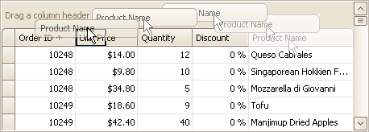
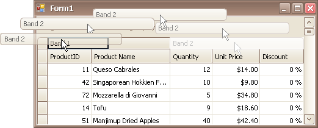

# Rearrange Grid Columns, Bands and Card Fields
## Reorder Columns and Bands in Grid Views
To reorder columns, drag and drop a column header to a new position:

To reorder bands, drag and drop a band header to a new position:

## Rearrange Card Fields in Layout Views

Do the following:
1. Click the Customization button displayed within the header panel:
	
	
	
	The LayoutView Customization window will open:
	
	
2. Rearrange fields using drag and drop, as required.
3. Close the Customization window to apply the changes.