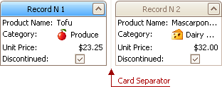

# Resize Cards in Grids
## Resize Cards in Card Views
In Card Views, to resize cards horizontally, drag card separators (if they are visible):

## Resize Cards in Layout Views
In Layout Views, to resize cards do the following:
1. Click the Customization button displayed within the header panel:
	
	
	
	The LayoutView Customization window will open:
	
	
2. Resize the template card as required.
3. Close the Customization window to apply the changes.