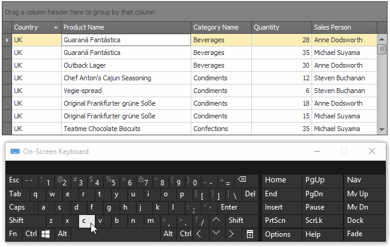

# Locate Grid Records
In Grid Views, you can locate a data row by typing the initial characters of the values contained in this row.

To locate the nearest row that contains a specific value in a specific column, do the following:
* Focus any cell in the column, against which a search will be performed.
* Type the initial character(s) of the value to be located. The nearest row that contains the specified value in the clicked column will be located.

To proceed with the search in the forward direction, press CTRL+DOWN ARROW.

To proceed with the search in the backward direction, press CTRL+UP ARROW.

To erase the previously typed characters in the search string, press BACKSPACE.

