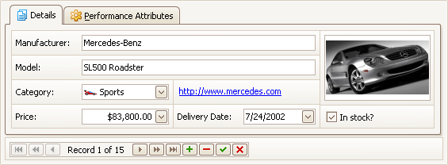

# Layout Manager
This section describes the capabilities provided by the Layout Manager. It maintains a consistent layout of controls within a form for you, so whenever you resize the form, the controls do not overlap. You can invoke customization mode to temporarily hide specific editors, and then show them again, resize the controls, save and then restore the layout, etc.

&nbsp;

**Layout Customization**
* [Start Layout Customization](layout-manager/layout-customization/start-layout-customization.md)
* [Finish Layout Customization](layout-manager/layout-customization/finish-layout-customization.md)
* [Hide and Display Elements using a Layout Manager](layout-manager/layout-customization/hide-and-display-elements-using-a-layout-manager.md)
* [Change Element Layout](layout-manager/layout-customization/change-element-layout.md)
* [Resize Interface Elements](layout-manager/layout-customization/resize-interface-elements.md)
* [Add Empty Regions, Separators, Splitters and Labels](layout-manager/layout-customization/add-empty-regions-separators-splitters-and-labels.md)
* [Change Text Label Options](layout-manager/layout-customization/change-text-label-options.md)
* [Work with Interface Element Groups](layout-manager/layout-customization/work-with-interface-element-groups.md)
* [Create and Delete Tabbed Groups](layout-manager/layout-customization/create-and-delete-tabbed-groups.md)

&nbsp;

**Save and Restore Layout**
* [Save and Restore Interface Layout](layout-manager/save-and-restore-layout/save-and-restore-interface-layout.md)