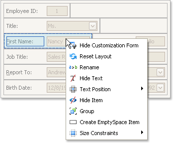
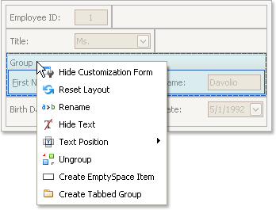

# Change Text Label Options
To perform layout customization, first invoke [Customization Mode](start-layout-customization.md). After customization has been completed, [exit](finish-layout-customization.md) customization mode.

## Rename Labels
To rename a layout item's text label, right-click the item and select **Rename** from the context menu.

To rename a group, right-click the group's caption and select **Rename**.

## Change a Label's Visibility
To hide a layout item's text label or a group's caption, right-click the item/group and select **Hide Text** from the context menu.

To display a layout item's hidden text label or a group's hidden caption, right-click the item/group and select **Show Text**.

## Change a Label's Position
To change the position of an item's label or a group's caption, right-click the item/group to open the context menu. Then, select **Text Position** and the required command from this submenu.