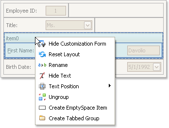
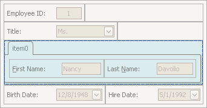
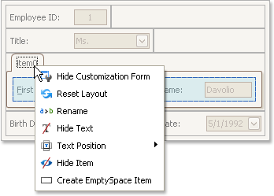
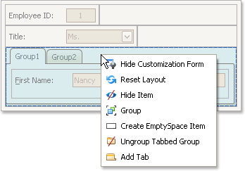
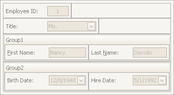

# Create and Delete Tabbed Groups
To perform layout customization, first invoke [Customization Mode](start-layout-customization.md). After customization has been completed, [exit](finish-layout-customization.md) customization mode.

## Combine Layout Items into a Tab Control
1. Select a layout item that is to be added to a tab control by clicking it.
	
	You can select multiple items simultaneously by clicking them while holding the SHIFT key down.
2. Right-click any of the selected layout items and select **Group** from the context menu:
	
	
	
	Note that only adjacent selected layout items can be combined into a group, and only if the region occupied by them forms a rectangle. Otherwise, the **Group** command is not available when right-clicking the selection.
	
	As a result, a new group is created:
	
	
3. Right-click the group's caption and select **Create Tabbed Group**.
	
	
	
	This creates a tab control with one tab displaying the contents of the original group.
	
	

You can subsequently rename the created tab and customize the contents of tab pages using drag-and-drop and context menus, if required.

## Combine Groups into a Tab Control
To transform a group into a tab control, right-click the group's caption and select **Create Tabbed Group**.

To add a group as a tab page to an existing tab control, drag the group's caption onto the tab control's header area.

## Rename Tab Pages
Do the following:
1. Right-click a tab header and select **Rename**:
	
	
2. Type a new name and press ENTER.

## Customize Tabbed Groups
To customize the layout of controls and the order of tab pages within a tab control , use drag-and-drop.

## Ungroup Tabbed Groups
To disassemble a tab control into regular groups, right-click the tab control's header area and select **Ungroup Tabbed Group**.

As a result, the tab control will be destroyed and all its tab pages will be displayed as regular groups, one below another.

