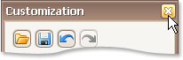

# Finish Layout Customization
To finish [customization](start-layout-customization.md), do one of the following:
* Close the Customization form by clicking on its close button.
	
	
* Right-click the form and select **Hide Customization Form**.
	
	