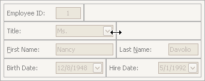

# Resize Interface Elements
To perform layout customization, first invoke [Customization Mode](start-layout-customization.md). After customization has been completed, [exit](finish-layout-customization.md) customization mode.

## Resize Layout Items
To resize a layout item, drag the layout item's edge:

## Lock Size
To lock a layout item's size, and prevent it from being resized (for instance, when the size of the container changes), right-click on a layout item and select the **Size Constraints** | **Lock Size** menu command:

