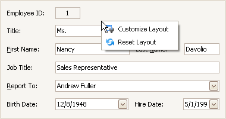
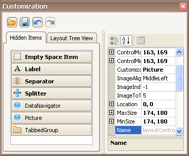

# Start Layout Customization
The layout of controls can be modified in customization mode. To invoke customization mode, right-click an empty space within the Layout Manager and select **Customize Layout**:

As a result, the Customization Form opens a list of service items and currently hidden elements:

Now, you can modify the current layout using drag-and-drop and resizing operations and commands provided by context menus. Context menus that can be invoked by right-clicking within the Layout Manager provide various customization commands. Different commands are available depending upon the type of a layout item which has been right-clicked (a regular control, a group or tabbed group).