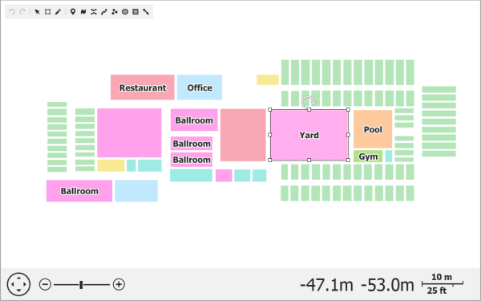

# Map Editor
The Map Editor is a built-in tool that allows you to create and modify map items. You can also relocate map items on the map surface, rotate them using a rotation handle, and resize items using the sizing handles. The Map Editor's active mode determines which actions you can perform while editing the map. Use the corresponding editor panel buttons to switch between the Default, Transform, Edit and Create modes.

## Map Editor's Panel

The Map Editor's panel consists of the following elements:

-  - Cancels the last action.
-  - Restores the last canceled action.
-  - Enables Default mode.
-  - Activates Transform mode.
-  - Turns on Edit mode.
-  - Enables "Create Pushpin" mode to create pushpins.
-  - Enables "Create Path" mode to create map paths.
-  - Activates "Create Polyline" mode to create map polylines.
-  - Enables "Create Dot" mode to create map dots.
-  - Enables "Create Ellipse" mode to create ellipses.
-  - Turns on "Create Rectangle" mode to create map rectangles.
-  - Enables "Create Line" mode to create map lines.

## Map Editor Modes

The Map editor provides the following modes that define the available actions when editing the map:

### Default Mode

You can only view the map and cannot to edit, create and transform map items when the Default mode is enabled. You can use the  button to turn on this mode. 

### Transform Mode

Select the  symbol to enable the Transform mode. This mode allows you to resize and rotate the selected map items using the sizing and rotation handles that appear when selecting items. You can also move map items by dragging them to the desired location.

### Edit Mode

Use the  button to enable the Edit mode. It allows you to move, add, and remove item vertices to change vector map shapes. To edit a map item in this mode, select an item to display its points and perform one of the following actions:

|Action|Animation|Description|
|---|---|---|
|Moving vertices||Relocates an existing map shape's point by dragging it to a new position.|
|Adding vertices||To add a new vertex, hover the mouse pointer over the item's edge between two neighbor points and click where you want to insert a new vertex.|
|Removing vertices||Removes a map shape's point by double-clicking it.|

Note that you can only edit the following map vector items:
- Map line
- Map path
- Map polygon
- Map polyline

### Create Mode

Create mode allows you to add new items to the map. Select one of the following symbols to create map items:       

You can add dots and pushpins by clicking at the required location. To create a complex map item, sequentially add points to form a map item. The following animation shows how to create a map path:

