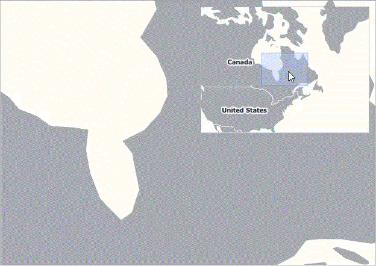

# Mini Map
The Mini Map provides a complete overview of the map, as well as additional information about the current map viewport, and allows you to navigate to different map regions.

The mini map supports the following behavior modes.

**Fixed**

When a mini map operates in fixed behavior mode, its center point and zoom level are fixed. The following image demonstrates fixed behavior mode.

Note that center point of the mini map stays the same when the map's center point changes, as well as the zoom level.

**Dynamic**

In a dynamic behavior mode, mini map settings are changed according to the zoom level and center point of the owner map. The following image demonstrates dynamic behavior mode.

Note that center point of the mini map is changing depending on the map's center point, as well as the zoom level.

