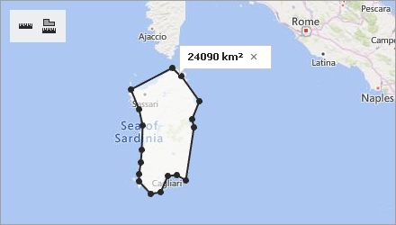
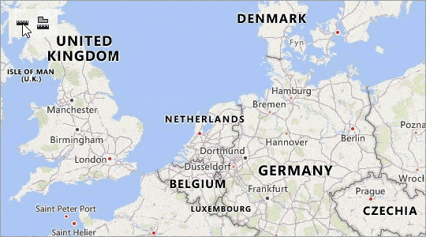
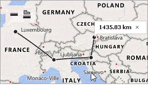

# Rulers
You can use rulers to measure distances and areas on a map.

| Distance Ruler | Area Ruler | 
|:---:|:---:|
|  | | 

## Measure Distances

Click  the  button to create a distance ruler. This ruler calculates the distance between two or more points on a map. The total distance is shown in a map callout. Note that measurements ignore changes in elevation.

 

Click an intermediate point on the ruler to see the distance to this point.

 

## Measure Areas 
Click  button to create an area ruler. This ruler calculates the area inside a polygon. The result is shown in a map callout.

 
## Configure Rulers

After you add a ruler to a map, you can perform the following actions:

* **Add a ruler point**.  Click the position on the ruler where you want to add a point.

     

* **Change the ruler polyline**. Click and drag the point to a new location.

    

* **Delete a ruler point**. Double-click the ruler point. You can delete a point when the ruler contains more than two points. You can remove only the entire ruler if it contains two points.
 
    

## Remove Rulers

You can click the cross button on the map callout that displays the measurement results to remove a ruler. 

 
