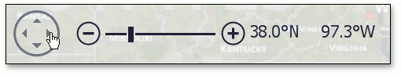

# Scrolling
The following operations can be performed by end-users to scroll a map.

| Action | Example | Description |
|---|---|---|
| Hold down the left mouse button and drag it. |  | When an end-user holds down the left mouse button, the mouse pointer changes from  to . Move the mouse pointer by holding down the left mouse button. The map is scrolled in the same direction as the mouse pointer is moved. |
| Use the arrows in the map navigation panel. |  | An end-user can scroll a map in four directions by clicking the arrows in the map navigation panel. For example, to move east, use the right arrow in the navigation panel. |
| Use the "Arrow" keys (LEFT, UP, RIGHT or DOWN). |  | If an end-user presses the LEFT arrow key, the map is moved west; if an end-user presses the UP arrow key, the map is moved north; if an end-user presses the RIGHT arrow key, the map is moved east; if an end-user presses the DOWN arrow key, the map is moved south. |
| Use flick gestures on a touchscreen device. |  | An end-user can scroll a map using flick gestures on a touchscreen device. |