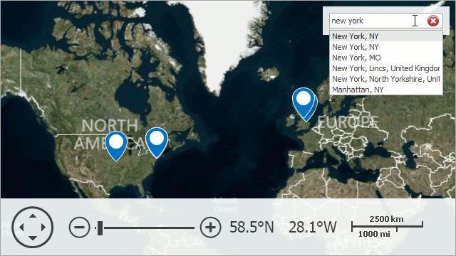
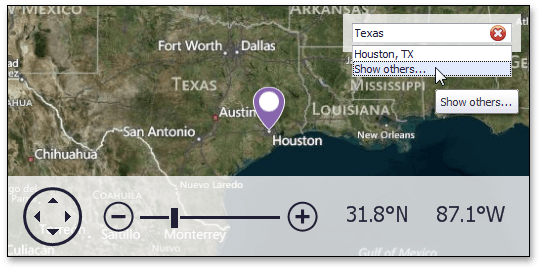
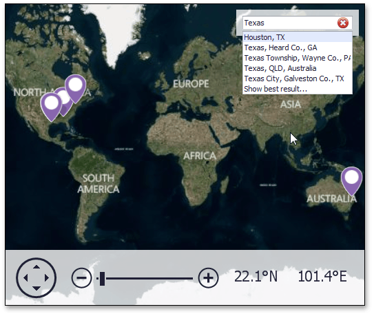

# Using the Search Panel
This document explains how to use a search panel in the **Map** control.

The **Search Panel** is a UI element that accepts text input and displays the results of a search request returned by the search service.

The Search Panel allows you to find a location on the map and see the search results for a request in the panel.

To start a search, type a place name ("Texas", for example) in the panel. The result is shown in the image below.

To cancel a request, click the delete () icon on the right side of the panel.

Notice that the map pushpin only shows the "Houston, TX" location on the map. Note, however, that the search result also displays the **Show others…** item, which means that the **Microsoft Bing Search** service found alternative results for this request.

Click the  **Show others...** option to see the other search results.

Other search results ("Texas, Heard Co., GA", "Texas, QLD, Australia", etc.) will be displayed along with the **Show best result…** option.

To see only "Houston, TX", click **Show best result…** in the Search panel.