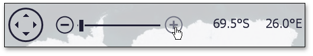
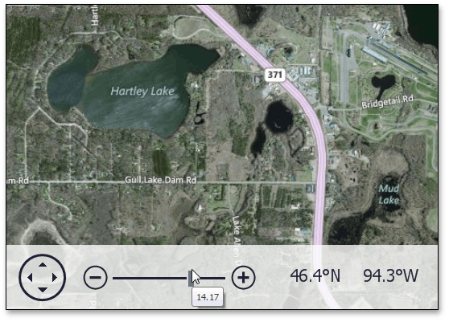
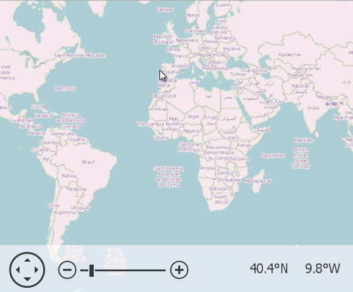
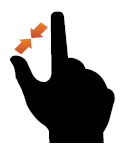
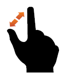

# Zooming
The following operations can be performed by end-users to zoom in to or out of a map.

| Action | Example | Effect |
|---|---|---|
| Use the **Plus** or **Minus** symbols in the map navigation panel |  | Click the **Plus**  or **Minus**  symbols in the map navigation panel. |
| Use the track bar slider in the map navigation panel. |  | Select the track bar slider in the map navigation panel by hovering the mouse cursor over the slider. Drag the track bar slider to the right (zoom in) or to the left (zoom out) in the map navigation panel. To stop zooming, release the left mouse button. Note that a tooltip that displays the current zoom level appears below the track bar slider. |
| Drag an area on the map while holding the **Shift** and **Ctrl** keys. |  | Hold the **Shift** and **Ctrl** keys, and the left mouse button. Then, drag the mouse pointer. This draws a rectangle on the map that corresponds to the map zoom region. To zoom into the specified rectangular area, release the left mouse button. |
| Use the **+** or **-** keys. |  | If the "**+**" key is pressed, the map is zoomed in. If the "**-**" key is pressed, the map is zoomed out. |
| Use the mouse wheel |  | Scroll the mouse wheel to zoom in to and out of a map. |
| Use the spread or pinch gesture on a touchscreen device |   | Zoom in to or out of a map by performing a spread or pinch gesture on any touchscreen device. |