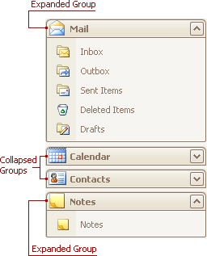
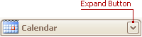
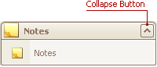
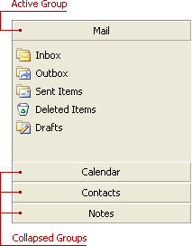

# Navigation Bar
## Expand Groups in the Navigation Bar That Can Display Multiple Groups at One Time
Windows Explorer Bar style navigation bars can display multiple groups at one time, as in the image below:

To collapse a specific expanded group, click the expand button within the group's header:

To expand a specific collapsed group, click the collapse button:

## Expand Groups in the Navigation Bar That Displays One Group at a Time
To expand a specific collapsed group, click the group's button. The previously opened group will be collapsed.

