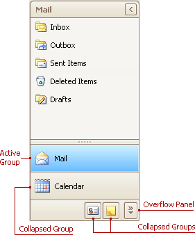
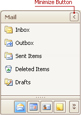
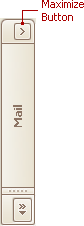
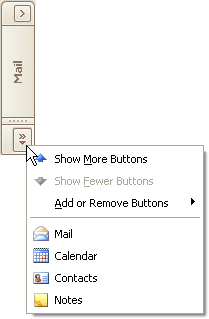
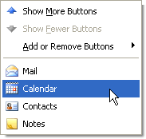

# Navigation Pane
## Expand Groups
A Navigation Pane displays only one group at a time. Other groups are collapsed and their buttons are displayed at the bottom or in the Overflow panel. You can use the horizontal splitter to control the number of group buttons shown outside of the Overflow panel.

To activate a group, click its caption button.

## Minimize the Navigation Pane
To minimize the Navigation Pane, click the Minimize button:

## Display the Contents of the Minimized Navigation Pane
To display the contents of a minimized Navigation Pane, you can restore it to its normal state, or display its contents while it's in the minimized state.

To restore the minimized Navigation Pane to its normal size, click the Maximize button:

To display the contents of the Navigation Pane when it's in the minimized state, click the current group's button:

To display the contents of the group that is currently hidden, do the following:
1. Click the dropdown button at the bottom of the Navigation Pane:
	
	
2. Select the required group in the menu that opens:
	
	
3. Click the current group's button:
	
	