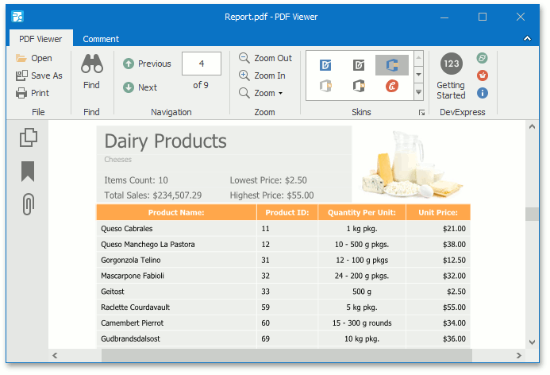

# PDF Viewer

This section describes the **PDF Viewer** features.

The PDF Viewer can display PDF files with different document content such as text, images, vector graphics, etc.

The section consists of the following articles:

* [Manage Documents and Files](pdf-viewer/manage-documents-and-files.md)
* [Print Documents](pdf-viewer/print-documents.md)
* [Navigate and View a Document](pdf-viewer/navigate-and-view-a-document.md)
* [Adjust the Document View](pdf-viewer/adjust-the-document-view.md)
* [Select and Copy the Document Content](pdf-viewer/select-and-copy-the-document-content.md)
* [View Document Properties](pdf-viewer/view-document-properties.md)
* [Thumbnails](pdf-viewer/thumbnails.md)
* [Bookmarks](pdf-viewer/bookmarks.md)
* [File Attachments](pdf-viewer/file-attachment.md)
* [Annotations](pdf-viewer/annotations.md)
* [Export and Import the AcroForm Data](pdf-viewer/export-and-import-the-acroform-data.md)
