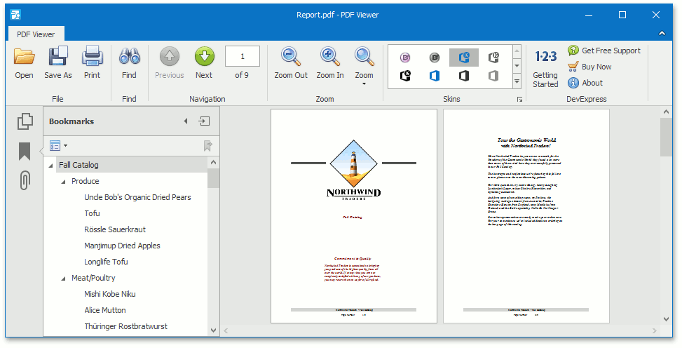

# PDF Viewer
This section describes the capabilities of the **PDF Viewer**.

The PDF Viewer used to displaying PDF files and supports various document content such as text, images, vector graphics, etc.

The following sections are available in this guide.
* [Manage Documents and Files](pdf-viewer/manage-documents-and-files.md)
* [Print Documents](pdf-viewer/print-documents.md)
* [Navigate and View a Document](pdf-viewer/navigate-and-view-a-document.md)
* [Adjust the Document View](pdf-viewer/adjust-the-document-view.md)
* [Select and Copy the Document Content](pdf-viewer/select-and-copy-the-document-content.md)
* [View Document Properties](pdf-viewer/view-document-properties.md)
* [Thumbnails](pdf-viewer/thumbnails.md)
* [Bookmarks](pdf-viewer/bookmarks.md)
* [File Attachment](pdf-viewer/file-attachment.md)
* [Export and Import the AcroForm Data](pdf-viewer/export-and-import-the-acroform-data.md)