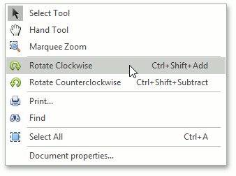
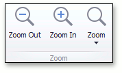
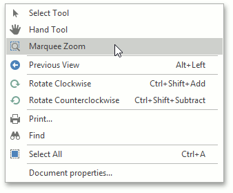
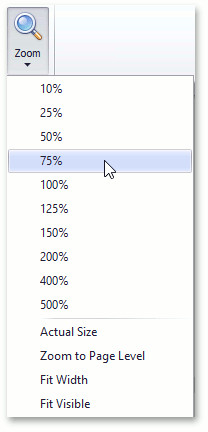

# Adjust the Document View
This topic describes the features that adjust the view in the PDF Viewer.

The document consists of the following sections.
* [Rotate a Document](#rotate)
* [Zoom In and Out of a Document](#inout)
* [Using Marquee Zoom Tool](#marqueezoom)
* [Use a Specific Zoom Factor](#zoomfactor)

## <a name="rotate"/>Rotate a Document
To rotate a document, use the following commands.
* **Rotate Clockwise**
	
	Rotates the document clockwise through **90** degrees. To perform this command, right-click the viewed document, choose the **Rotate Clockwise**  item, or press **Ctrl + Shift + Add**.
	
	
* **Rotate Counterclockwise**
	
	Rotates the document counterclockwise through **90** degrees. To do this, invoke the context menu by right-clicking the document, choose the **Rotate Counterclockwise**  item, or press **Ctrl + Shift + Subtract**.

## <a name="inout"/>Zoom In and Out of a Document
Use buttons from the **Zoom** button group of the PDF Viewer tab.

To zoom in a document, click the **Zoom In** button on the toolbar, or press **Ctrl**+**Plus** sign.

To zoom out of a document, click the **Zoom Out** button on the toolbar, or press **Ctrl**+**Minus** sign.

To zoom in or out of a document, you can also hold down **Ctrl** and rotate the mouse wheel.

## <a name="marqueezoom"/>Using Marquee Zoom Tool
The **Marquee Zoom** tool allows end users to zoom in a particular part of the page.

To activate the **Marquee Zoom** tool:
* right-click the viewing document;
* select the **Marquee Zoom**  item  in the context menu.
	
	

You can perform the following actions:
* zoom in on a portion of a page by dragging a rectangle around it;
	
	
* increase the zoom level by clicking;
* decrease the zoom level by clicking while pressing the **Ctrl** key.

## <a name="zoomfactor"/>Use a Specific Zoom Factor
To zoom to a specific zoom factor, click the **Zoom** dropdown list button. The following list will be invoked.

Choose the percentage value of the zoom factor or one of the following zoom factor presets.
* **Actual Size**
	
	Sets the document zoom factor value to **100**%.
* **Zoom to Page Level**
	
	Sets the document zoom factor value to fit the entire page height.
* **Fit to Width**
	
	Sets the document zoom factor value to fit the entire page width.
* ### Fit to Visible
	
	The document zoom factor is calculated to fit the actual content of a page (if possible).