# Annotations

You can use annotations to highlight important text the author should change, for example, when you review a document.

The PDF Viewer allows you to create text annotations (sticky notes) and text markup annotations (text highlights). All document annotations are displayed in the **Comments** panel.

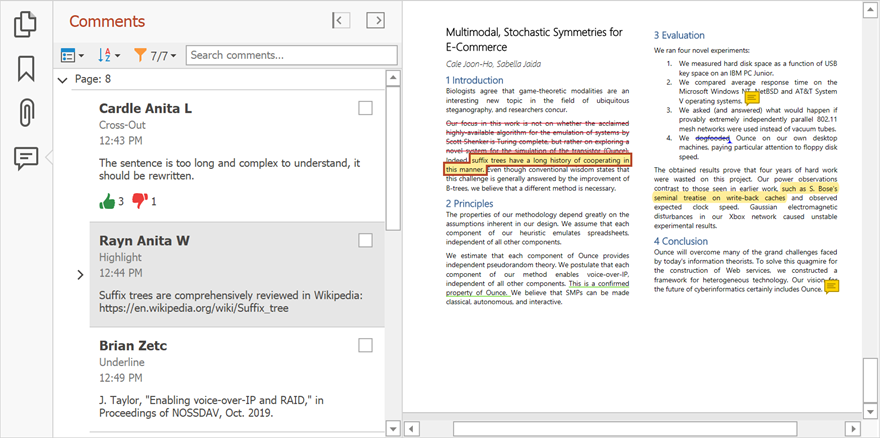

## Create Annotations

Use commands on the **Comment** ribbon page to create text markup annotations and sticky notes. Enable the selection tool in the **Text** group and select the text that should have an annotation. Click **Sticky Note** to place the sticky note in a document.

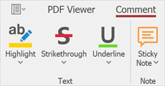

You can also add text markup annotations from the context menu.

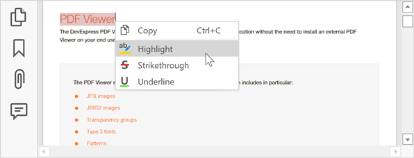

You can change the default settings for annotation tools. Click the drop-down arrow in the corresponding annotation tool in the **Text** ribbon group and specify the color and opacity.

## Edit Annotations

Double-click the annotation in the **Comments** panel to edit its contents.

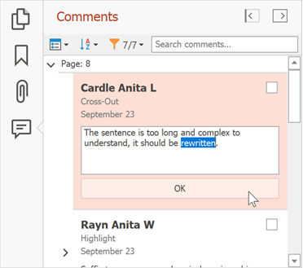

Right-click the annotation in the document or **Comments** navigation page and select **Properties...** to invoke the **Annotation Properties** dialog.

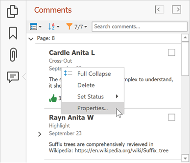

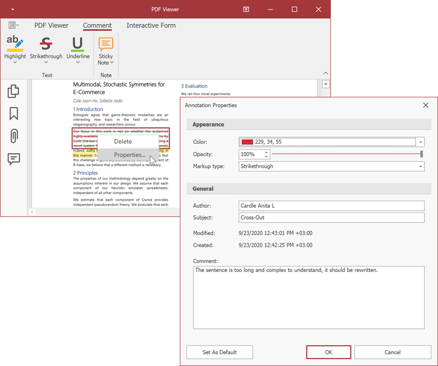

 This dialog allows you to change the annotation parameters. Click **Set as Default** to use the new settings as the default settings for all annotations.

## Add Replies and Reviews to the Annotation

You can use the **Comments** navigation pane to add replies and set review statuses for the annotations.

Select an annotation on the pane, enter text in the invoked editor, and click **Reply** to add the reply to the annotation.

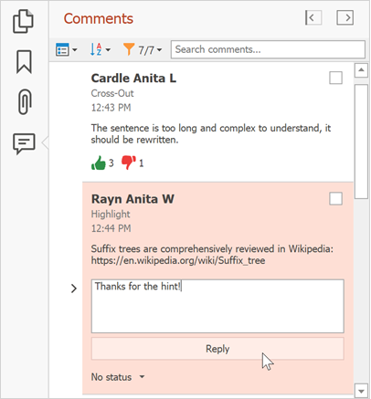

To specify the review status, right-click an annotation, select Set Status, and set the status. Select None to remove the review status.

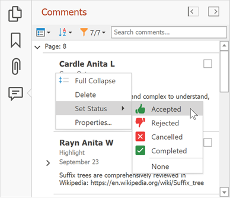

## Sort and Filter Annotations

You can sort and filter comments by page, author, date, type, check and review status.

Click the **Sort** button on the **Comments** navigation page to sort annotations and comments.

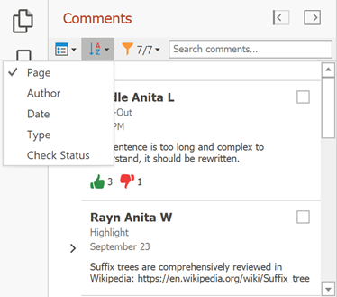

Click the **Filter** button to apply the filter. This filter is applied to the annotations in the pane and in the document.

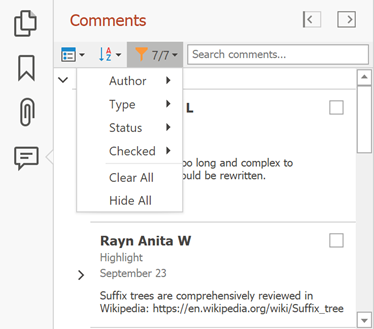

Use the **Search comments..** field to show annotations that contain the search text.

## Remove Annotations

Right-click an annotation in the document or **Comments** navigation pane and select **Delete** in the context menu to remove the annotation. You can also select an annotation and press the **Delete** key.

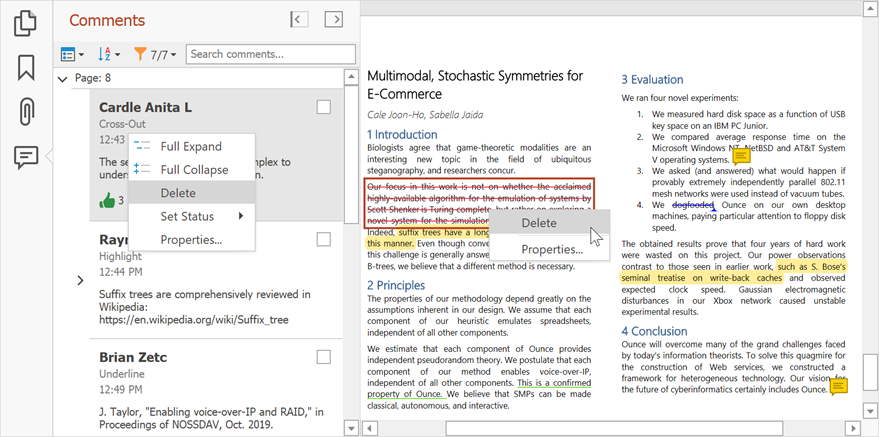
