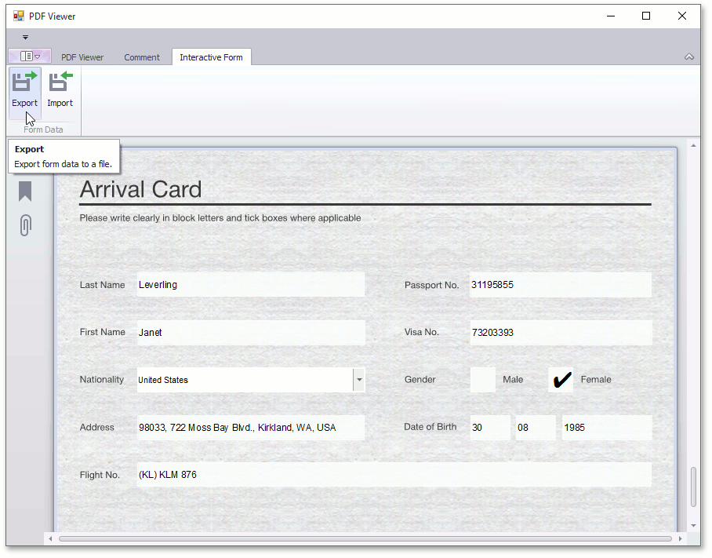
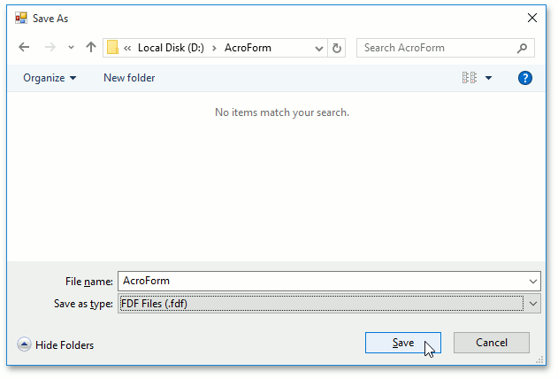
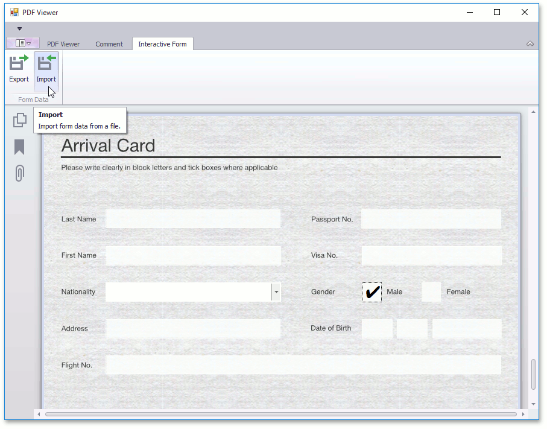
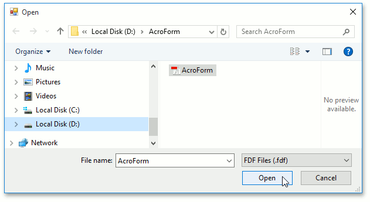
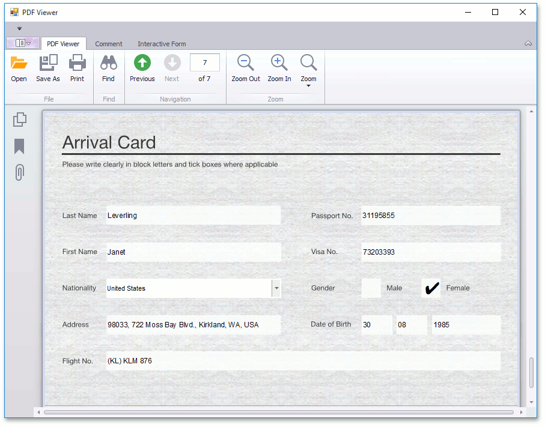

# Export and Import the AcroForm Data
This document describes how to export and import a document with AcroForm data.

**Export**

To export a PDF document with interactive forms to supported formats  (FDF, XFDF, XML or TXT).
* Click the **Export** button on the PDF Viewer's toolbar (if you use a Ribbon toolbar, you can find this button in the **Interactive Form** tab).
	
	
	
	The **Save As** dialog appears.
	
	
	
	In this dialog you specify a file name, and the format in which the document should be exported (FDF, XFDF, XML or TXT). To save a document, click **Save**, as shown above.

**Import**

To import a document that contains interactive forms from FDF, XFDF, XML or TXT:
* Click the **Import** button on the PDF toolbar (in the Ribbon toolbar you can find this button in the **Interactive Form** tab).
	
	
* This invokes the **Open** dialog box, where you can choose a file with interactive forms (e.g., in the FDF format) to import data. To perform import, click **Open**.
	
	
* The imported document is shown below.
	
	