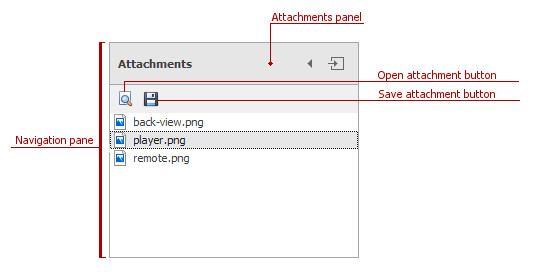
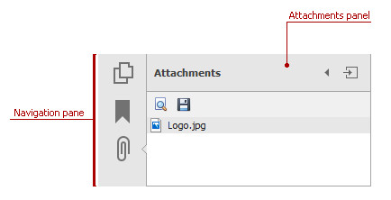
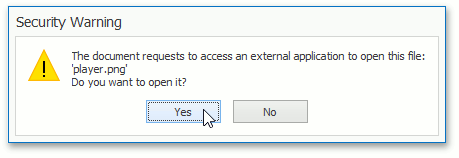
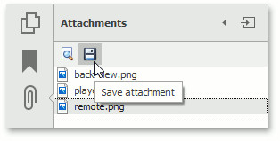
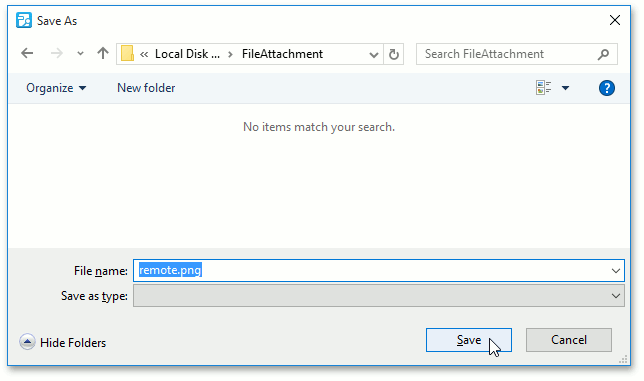

# File Attachment
This document describes actions that can be performed on attachments in the PDF Viewer.

An attachment is a file that is attached to a PDF document. The PDF Viewer shows the file attachments in the **Attachments** panel of the navigation pane.

## <a name="open"/>Open an attachment
To open a file attachment for viewing, you need an application which supports the corresponding file format to be installed in your computer. To view an attachment, do one of the following.
* double click the attached file;
	
	or
* select the file and click the "Open file in its native application" icon in the **Attachments** panel.
	
	

The **Security Warning** message appears. It warns you that the PDF Viewer will be use an external application to open the attached file.

Click **Yes** to open the attached file, otherwise click **No**.

## <a name="save"/>Save an attachment
The file attachment can be saved to your disk. To do this, select the file and click the "Save attachment" icon, as shown below.

The **Save As** dialog appears.

Choose the file attachment  location on the disk, specify the file name, and click **Save**.