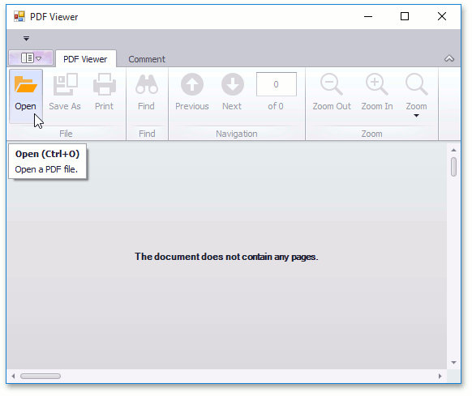
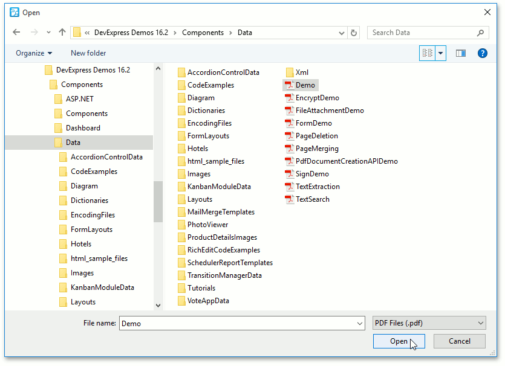
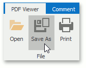
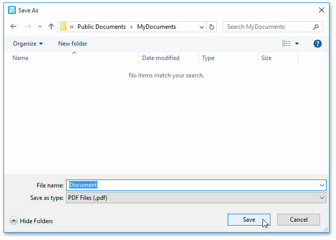

# Manage Documents and Files
This document describes how to open and save PDF files using the PDF Viewer.

This topic consists of the following sections.
* [Open a PDF File](#open)
* [Save a PDF File](#save)

## <a name="open"/>Open a PDF File
To open a document for viewing, click the **Open** button, or press **Ctrl**+**O**.

In the invoked dialog, choose a PDF file and click **Open**.

## <a name="save"/>Save a PDF File
If you need to save your PDF file to disk, click the **Save As** button, or press **Ctrl**+**S**.

In the invoked **Save As** dialog, locate the folder where you want to store your file, enter the document's name and click **Save**.

Your document will be saved with the **.pdf** file extension.