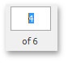
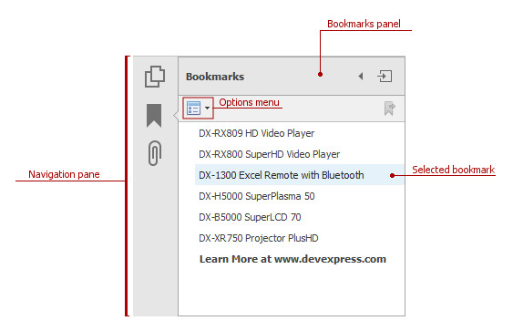
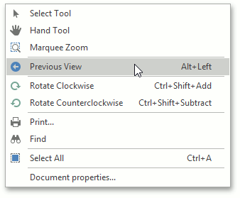
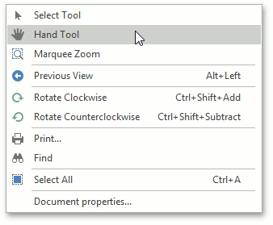
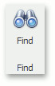
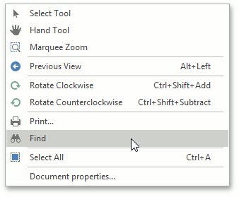
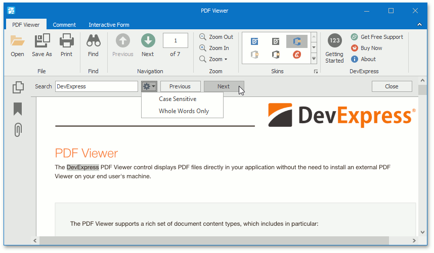

# Navigate and View a Document
This document provides information on using the PDF Viewer user interface to navigate through the document content.

The topic consists of the following sections.
* [Navigate Between Pages](#navigation)
* [Navigate Between Viewes](#views)
* [Search for a Specific Text](#search)

## <a name="navigation"/>Navigate Between Pages
To navigate between pages, use one of the following.
* The scrollbars.
* **Previous** and **Next** navigation buttons.
	
	
	
	These buttons allow you to switch to the previous or next page of a document.
* The **Pager** that is used to show the current page number and the total number of pages in a document.
	
	
	
	To change the page number in the **Pager**, type a new page number and press **ENTER**.
* The **Bookmarks** panel located on the Navigation pane.
	
	
	
	To jump to a topic, click a bookmark.
* The **Page Thumbnails** panel located on the Navigation pane.
	
	
	
	To jump to the page in a document, click a page thumbnail in the **Page Thumbnails** panel.

## <a name="views"/>Navigate Between Views
To change the page view, use one of the following.
* Right-click this document and select the **Previous View**  or **Next View**  item in the invoked context menu.
	
	
	
	or...
	
	press **Alt**+**Left** or **Alt**+**Right**.
* Move a page with the **Hand** tool.
	
	The **Hand** tool enables you to scroll content by dragging the document instead of using scrollbars.
	
	To activate the **Hand** tool, right-click the viewing document and select the **Hand Tool**  item in the context menu.
	
	
	
	Then, after you click the document's page, the mouse pointer is changed from  to . Drag the mouse pointer to scroll the document.
* Use zoom toolbars to change page magnification. For more details, see the **Adjust the Document View** topic.

## <a name="search"/>Search for a Specific Text
To search for a specific text within a document, click the **Find** button on the toolbar.

Otherwise, to invoke the **Find** dialog, right-click the document and select the **Find**  item in the context menu, or press **Ctrl**+**F**.

In this dialog, you can input the text to find, and specify whether to match case or the whole word during the search. Click the **Previous** and **Next** buttons to set the search direction.

To start searching or search again, click the **Previous** or **Next** button, or press **ENTER**.