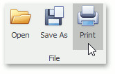
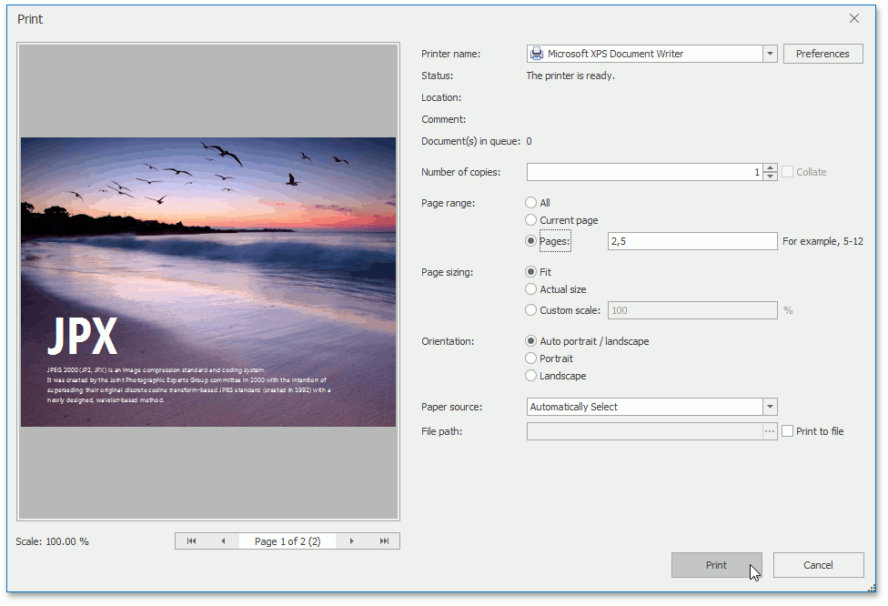
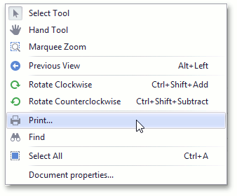

# Print Documents
To print the current document, click the **Print** command located on the **File** toolbar button group, or press **CTRL**+**P**.

In the invoked standard **Print** dialog, choose the printer, specify the printing parameters and click **Print**.

Alternatively, to invoke the **Print** dialog, right-click the document area and select the **Print...**  item in the context menu.

