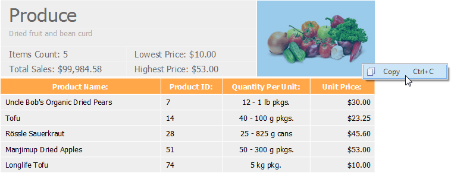
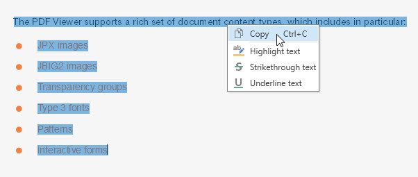

# Select and Copy the Document Content
The PDF Viewer provides for selecting and copying text from the selectable document to the clipboard.

To enable the selection mode, invoke the context menu and choose the **Select Tool** item. This mode is active by default.

To copy an image:

* select the image or any part of an image;

* right click the image and select the **Copy** command in the context menu, or press **Ctrl**+ **C**;

* paste the image into a desired application by choosing the **Past** command in the context menu, or pressing **Ctrl**+**V**.

To copy text:

* highlight the text you desire; 

* choose the **Copy** command in the context menu, or press **Ctrl**+**C**;

* paste the content into an application. 

To select all the text in a document for copying, invoke the context menu and choose the **Select All**  command, or press **Ctrl**+**A**.

